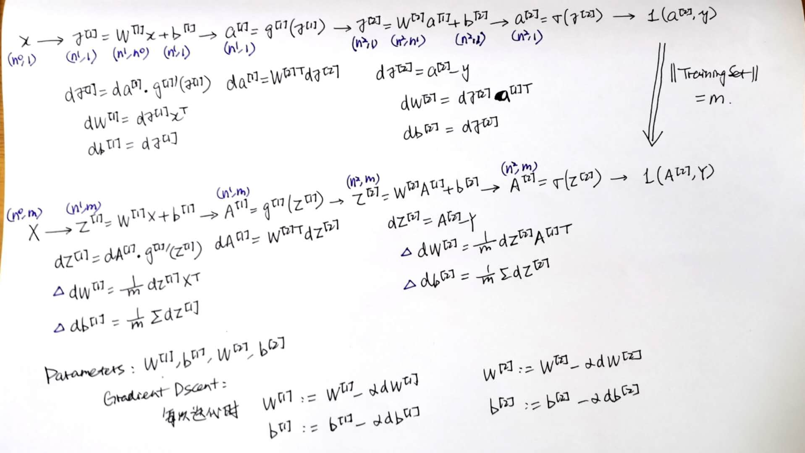
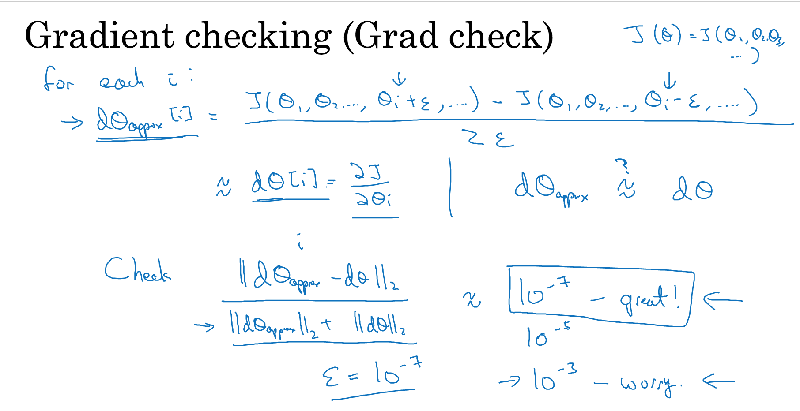
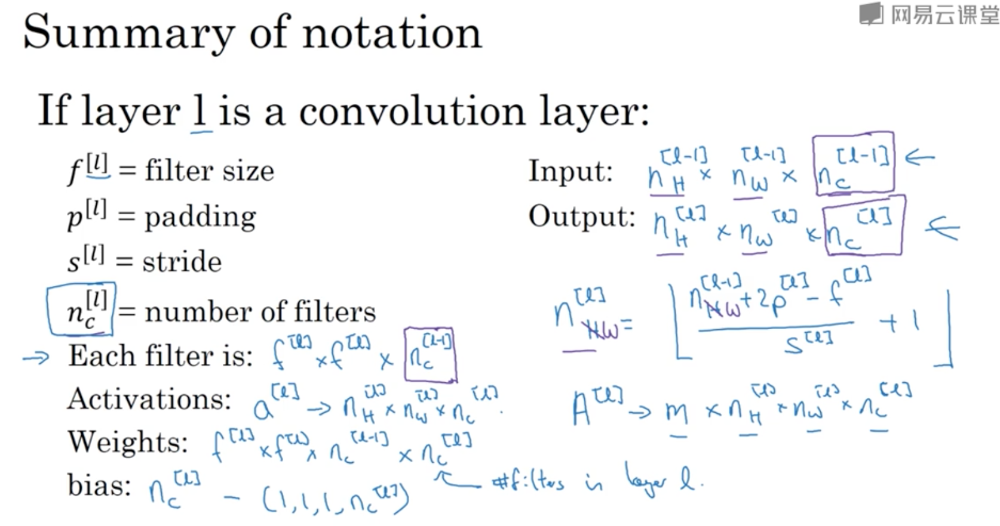
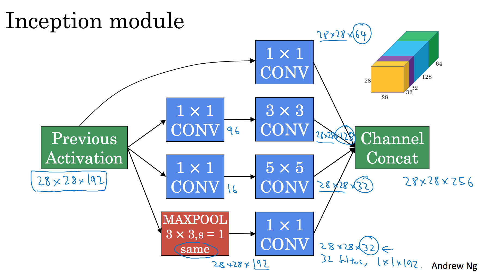

# 深度学习基础
目录  
1. [神经网络NN](#神经网络)
    * [逻辑回归](#二分分类)
    * [浅层神经网络](#浅层神经网络)
    * [深层神经网络](#深层神经网络)
2. [深层神经网络优化](#深层神经网络优化)
    * [优化方法](#实用优化方法)
    * [优化算法](#优化算法)
3. [卷积神经网络 CNN](#卷积神经网络)
    * [边缘检测](#边缘检测)
    * [深度卷积神经网络](#深度卷积神经网络)
* * *
## 神经网络 Neural Network
* 使用神经网络（简称NN）时，通过设置输入层 input layer，NN自动生成中间的隐藏单元 hidden units，得到输出的预测值
* NN用于监督学习，常见的应用包括：
    * 广告推荐 -> Standard NN
    * 图像识别 -> CNN，处理图像
    * 音频识别，翻译 -> RNN，处理一维的序列化数据
* 数据分类：结构化数据，按表格存储的数据，特征定义十分清晰；非结构化数据，比如图像、音频、文字等。
* 提升NN的表现，主要通过两点：投入更多数据，或者建立更大、更复杂的网络模型。在数据量不大时，各种算法的表现比较接近，模型的最终表现更取决于一些设计细节，只有在处理大数据时，NN才能展现绝对的优势。

### 二分分类
* 用逻辑回归解决二分分类为例
    * 训练集大小为m
    * 输入特征向量x，尺寸为(n, 1)
    * m个x按列摆放得到矩阵X，尺寸为(n, m)
    * 输出预测结果a，以及真实的结果y，都属于{0, 1}。a = P(y=1 | x)，代表对于数据x，预测y为1的可能性
    * 模型参数为w，size=(n, 1)，以及实数b
    * a = sig((w.T)*x + b)，sig是sigmoid函数
    * 损失函数 Loss Function，体现模型预测结果对单个训练数据的偏差，这里记为 L(a, y)
    > L(a, y) = -(yloga + (1-y)*log(1-a))
    * 成本函数 Cost Function，体现模型预测结果对整个训练集的偏差，记为J(w, b)，是在训练集上所有L之和的平均值
* 通过前向传播，从输入向量到损失函数L，构建计算图；然后通过后向传播，求损失函数L对各个变量的偏导，从而通过梯度下降 Gradient Descent，迭代出参数的最优解。
    * dL/da，记作da, da = -y/a + (1-y)/(1-a)
    * z = (w.T)*x + b, dz = a - y
    * dwi = xi * (a - y)
    * db = dz
* 这个过程中，进行向量化十分重要，以避免显式的for循环。
    * 向量的运算相比显式的for循环快很多，使用SIMD (SingleInstructionMultipleData) 采取并行运算。
    * 比如：对于一个1000000*1维度的两个向量相乘，使用for循环大概需要500ms，但是如果使用numpy的函数，dot(x, y)，则只需要1.2ms
* 最终伪代码如下
>
    // 最外层循环，代表迭代次数
    for i in range(times):    
        Z = W.T*X + b = np.dot(W.T, X) + b  
        A = sigmoid(Z)  
        dZ = A - Y  
        dW = 1/m * X * dZ.T  
        db = 1/m * np.sum(dZ)  
    // 梯度下降更新参数，alpha为学习率  
        W := W - alpha * dW  
        b := b - alpha * db  

### 浅层神经网络
1. 浅层网络结构
* 以2层神经网络为例，输入层 input layer 为第0层不计入，中间为隐藏层 hidden layer，最后输出的一个单元是输出层 output layer
* 如果对隐藏层的一个节点进行表示，a的上标有，[l]表示当前所处的层数，(j)表示对于第j个训练样本，a的下标i则表示这是当前层第i个节点。
> 
    从第0层到第1层的计算：
    // X是训练集的x(j)按列堆叠 (n, m)
    // W[1]是参数w[1]i.T按行堆叠 (nodesNum, n)
    // b[1]是偏差值 (nodesNum, 1)
    // Z[1]是各个训练样本的z[1](j)按列堆叠 (nodesNum, m)
    // X也可以记作A[0]，是输入层传入的激活值
    Z[1] = W[1]X + b[1]
    A[1] = g[1](Z[1])
    // 从第1层到第2层同上
    Z[2] = W[2]A[1] + b[2]
    A[2] = g[2](Z[2]) = sigmoid(Z[2])
2. 激活函数
* g[l]是第l层的激活函数 activation function
    * 通常sigmoid只用于最后的输出层，给出一个0到1之间的结果
    * 在隐藏层中，和sigmoid相比，tanh的表现总是更好，相当于将sig平移到了中心，对数据处理也有中心化的效果
    * 最常用的激活函数是ReLU，a = max(0, z)
    * Leaky ReLU是ReLU的另一个版本，a = max(0.01z, z)
* 隐藏层的激活函数不能是线性的，因为线性函数的组合依然是线性函数，使用线性函数的隐藏层是没有意义的。
>
    a=sig(z)    sig'(z)=a(1-a)
    a=tanh(z)   tanh'(z)=1-a^2
    a=g(z), g=ReLU  g'(z)={0, if z<0; 1, if z>=0}
    a=g(z), g=LeakyReLU     g'(z)={0.01, if z<0; 1, if z>=0}
    // ReLU其实在0点是不可导的，需要指定使用左导/右导数，但是使用起来影响不大，因为落在0点的概率很低
3. 梯度下降
* 在本结构中，参数有，W[1], b[1], W[2], b[2]
* 依然采取前向传播构建网络，然后通过后向传播，计算损失函数对于每个参数的偏导，然后根据导数，采取梯度下降法找到参数的最优解。
* b可以初始化为全0，但是W不行，否则所有的隐藏单元都在进行相同的计算，设置多个隐藏单元就没有意义。
    * 所以一般需要对W进行随机初始化，初始化为比较小的值，因为W的初始值过大会导致落在sigmoid/tanh两端，很平缓的部分，那么梯度下降的速度就会很慢。
    * 比如，W[1] = np.random.randn((n1,n0))*0.01
* 计算过程见下图。n0, n1, n2分别表示各层对应的节点数，4个参数的偏导是前面标有△的4个方程。

### 深层神经网络
* NN的层数是隐藏层+输出层的总层数，深层神经网络的隐藏层不止一层，即总层数 L>2
    * 使用深层神经网络可以取得较好的效果。一般来说，前面的层针对一些简单的局部的特征进行探索，后面的层再进行组合，从而可以实现对复杂的、更为全局的特征的检测。比如人脸识别中，浅层神经元也是先负责对局部的边缘探测，然后再将边缘组合起来，得到五官的特征，最后再到全脸。
    * 从电路的理论上来理解，一般来说，为了达到一样的效果，采取深层模型需要的单元数远小于浅层模型。
#### 前向传播 FP
* 考虑从第l-1层到第l层的一个前向传播单元
    * 输入 a[l-1]
    * 输出 a[l]
    * 参数为 W[l], b[l], 缓存计算出的z[l]
* g[l]表示第l层使用的激活函数，第l层的单元数为n[l]，则各个矩阵的维度分别是：
    * z[l], a[l], b[l] -> (n[l], 1)
    * a[l-1] -> (n[l-1], 1)
    * W[l] -> (n[l], n[l-1])
    * Z[l], A[l] -> (n[l], m)，m是训练集大小
    * A[l-1] -> (n[l-1], m)
>
    // 对于单个样本
    z[l] = W[l]a[l-1] + b[l]
    a[l] = g[l](z[l])
    // 对于整个训练集
    Z[l] = W[l]A[l-1] + b[l]
    A[l] = g[l](Z[l])
#### 后向传播 BP
* 考虑从第l层到第l-1层的一个后向传播单元
    * 输入 da[l]
    * 输出 da[l-1], dW[l], db[l]
    * 参数为 W[l], b[l], dz[l]
>
    // 对于单个样本
    dz[l] = da[l] * g[l]'(z[l])
    dW[l] = dz[l]da[l-1].T
    db[l] = dz[l]
    da[l-1] = W[l].Tdz[l]
    // 向量化
    dZ[l] = dA[l] * g[l]'(Z[l])
    dW[l] = 1/m * dZ[l]dA[l-1].T
    db[l] = 1/m * np.sum(dZ[l], axis=1, keepdim=True)
    dA[l-1] = W[l].TdZ[l]
#### 构建模型
* 整个训练过程依然是进行梯度下降的迭代。一次迭代的过程是：
    * 先从当前的输入层和参数出发，计算前向传播，缓存计算过程中出现的z；
    * 直到最后输出层得到了本次预测结果yhat=a[L]，然后根据损失函数，计算da[L]作为后向传播的起始输入；
    * 再计算后向传播，直到输入层，根据计算得出的dW, db更新每一层的参数，完成一次迭代。
* 训练过程中优化的是常规参数，dW, db
* 模型的超参数包括：学习率alpha，迭代总次数，总层数L，每层单元数，每层采取的激活函数等

## 深层神经网络优化
### 实用优化方法
1. 数据
* 数据划分为：
    * 训练集 training set，对模型进行训练
    * 验证集 hold-out cross validation set / development set，进行交叉验证，选出最好的模型
    * 测试集 test set，对模型进行测试，获得模型的无偏估计
* 经典机器学习中，三者的比例划分为 70/0/30，或者 60/20/20
但是在大数据问题中：
    * 验证集和测试集的数据量不需要这么多，采取 98/1/1，甚至 99.5/0.4/0.1 即可
    * 可能数据量很大，数据来源不止一个，有不同的分布，但是要保证验证集和测试集的数据源相同
    * 如果不需要对模型进行无差估计，也可以不使用测试集

2. 偏差和方差
* 如果模型在训练集的表现较差，说明偏差 bias 高，也就是存在欠拟合的问题，需要
    * 扩大网络规模，增加层数、增加隐藏层单元数
    * 改变网络结构
    * 延长训练时间
* 如果模型在验证集的表现较差，说明方差 variance 高，也就是存在过拟合的问题
    * 增加投入的数据量
    * 正则化
    * 改变网络结构
* 这两个问题可能同时发生，比如模型局部欠拟合，同时局部过拟合。在深度学习中，偏差和方差可以通过以上的方法各自进行调节，相互之间的影响较小。

3. 正则化
* 逻辑回归中，在成本函数中，加上参数W的L2(L1)范数，可实现L2(L1)正则化。
    * L2Reg: lambd/(2*m) * (Wi平方的和)
    * L1Reg: lambd/(2*m) * (Wi绝对值的和)
    * lambd 是正则化因子，一个超参数
* NN中实现正则化：
    * L2正则化
        * 使用Forbenius范数，lambd/(2*m) * (各层权重 W 内的元素 Wij 平方和)
        * 相当于做参数更新时，从原来的 **W[l]=W[l]-dW[l]** 变为 **W[l] = (1-alpha\*lambd/m)\*W[l]-prev_dW[l]**
        * 为参数增加了一个小于1的权重，所以也称为权重衰减 Weight Decay
        * 缺点是选择合适的 lambd，计算开销较大
    * Dropout正则化
        * 采取反向随机失活，对第l层进行dropout
        >
            keep_prob = 0.8 // 神经元保留下来的概率
            dl = np.random.rand(al.shape[0], al.shape[1]) < keep_prob
            al = np.multiply(al, dl)
            al /= keep_prob
        * 每一层的保留概率，可以设置得不同。比如，对于单元数很多的隐藏层，其过拟合的概率更大，可以将对应的保留概率设置得小一些。
        * 因为al中部分元素归零失活，最后必须除以保留概率，保证使用al进行计算时期望值不受影响。
        * 降低神经元对输入特征的依赖，从而不会为输入特征设置过大的权重，达到和L2正则化一样的，收缩权重的效果。
        * 一大缺点是，一旦开启随机失活，就很难计算成本函数。所以一般来说，先将概率设置为1，确保成本函数递减以后，再开启随机失活。
    * Early stopping
        * 当训练集误差率持续降低，但是验证集的误差率开始升高时，提前终止训练
        * 优点是计算成本低；缺点是采用这种方法，在解决过拟合问题的同时，会影响到成本函数的最优化问题，无法同时达到偏差和方差的最优。

4. 输入标准化
* 对输入进行标准化处理，使得输入的各个维度数据范围相差不大；
* 有利于加速训练。因为不论随机选择哪个点开始迭代，都能以相对少的次数，快速找到全局最优解。

5. 梯度消失 vanishing 和梯度爆炸 exploding 问题
* 梯度以指数级快速减小/增加，就是梯度消失/爆炸
* 主要取决于权重W的设计，在网络层数较多的情况下，W略大于1，就会容易出现梯度爆炸，W略小于1，就会容易出现梯度消失
* 通过初始化抑制W的快速减小/增加：
    * Xavier初始化，初始化W时，根据W的形状，初始化随机数，然后乘上 sqrt(1/n)，n是上一层的单元数，也就是输入单元数。适用于tanh激活函数
    * He初始化，乘上 sqrt(2/n)，适用于ReLU激活函数

6. 梯度检验

* 先将所有层的参数，W[1], b[1],..., W[L], b[L]，连接成一个大向量 theta；然后将所有的梯度，连接成另一个向量 dthata
* 如上图所示，梯度检验就是利用一个很小的值，求dtheta的近似值，然后和真实值相比，如果差值过大，说明梯度的计算存在问题
* 使用时需要注意：
    * 梯度检验只用于debug，不用于训练
    * 如果采用了L2正则化，那在计算梯度时，需要把正则化的项考虑进来
    * 梯度检验不能和随机失活一起使用。如果采用了dropout正则化，需要先关闭dropout，然后进行梯度检测，检测无误后再打开dropout

### 优化算法
1. 梯度下降
* batch，批梯度下降。
    * 是之前一直使用的方法，必须对整个训练集进行处理，然后才能进行一次梯度下降，每次更新参数都应用了完整的训练集数据。
    * 代价函数J下降的曲线平滑；
    * 迭代时间长，训练慢，只适用于规模不大的数据集（2000以下）
* mini-batch，小批量梯度下降
    * 先对数据集分批，批的大小称为 batch_size，分批后，数据集X = [X(1) X(2) ... X(m)] 就变为 X = [X{1} ... X{#batches}]
    >
        for t in (1, #batches):
            // FP on X{t}
            Z[1] = W[1]X{t} + b[1]
            A[1] = g[1](Z[1])
            ...
            A[L] = g[L](Z[L])
            // cost function
            J{t} = 1/batch_size * sum(L(yhat, y)) + lamdb/(2*batch_size) * sum(Forbenius(W))
            compute grads;
            update parameters W[1], b[1], ..., W[L], b[L]
    * 使用小批量梯度下降，每对一批进行处理，都能更新一次参数。所以在一个 epoch 后，也就是一次完整的遍历后，可以对参数进行 #batches 次更新。
    * 成本函数J，受到分批训练的影响，会出现噪音，虽然总体还是下降的趋势。
    * 小批量梯度下降，一方面相比批梯度下降，加快了学习速度，另一方面相比 SGD，保留了向量化带来的好处。所以应用十分广泛，需要挑选批量的规模，常见的 batch_size 有：64，128，256，512，选择时还需要考虑到和 CPU/GPU 内存的匹配。
* StochasticGD，随机梯度下降，batch_size=1
    * SGD 永远不会收敛，最后会在最小值附近波动
    * 相当于一个batch内只有一个样本，这样就丢失了向量化带来的加速

2. 指数平均（移动）加权
* exponentially weighted (moving) average
* 比如对于一批数据 (x1, x2, ..., xt)
>
    v0 = 0;
    v1 = beta*v0 + (1-beta)*x1
    ...
    vt = beta*v(t-1) + (1-beta)*xt
* vt可以看做是，xt 及其前面的数据，共 (1/(1-beta)) 个数据的加权平均
    * 展开可以得到，vt多个x的和，xt的系数是(1-beta)，x(t-1)的系数是(1-beta)\*beta，x(t-2)的系数是(1-beta)\*beta^2
    * 所以各项系数呈指数衰减
* 指数移动平均计算起来更为高效，其实是对一个范围内平均数的一种估计
    * 如果beta取得过小，那么v是较少天数的平均，可以更为灵敏地反应x的变化，波动也更大
    * 如果beta取得过大，那么v是较多天数的平均，曲线平滑，但是对x的变化更迟钝，反应出来的曲线整体滞后
* 偏差修正 bias correction
    * 对于起始阶段，发现v取值过小
    * 所以增加偏差修正
    >
        vt = vt / (1 - beta^t)
    * 适当增大了起始的v，对于后面的v也基本上没有影响

3. GD with Momentum 动量梯度下降法
>
    for iteration t:
    compute grads dW, db;
    v(dW) = beta*v(dW) + (1-beta)*dW
    v(db) = beta*v(db) + (1-beta)*db
    // update params
    W = W - v(dW)
    b = b - v(db)
* 采取指数平均加权的形式，计算出v用于参数更新，相比简单的梯度下降，降低了抵达最小值路径上的波动，加快了学习速度。
* 一般不用进行偏差修正。偏差只会影响初始阶段，也就是大概10次迭代。
* 命名含义理解：如果将成本函数想象成碗，小球从碗口向下滚动，直到碗底，那么v理解为速度，beta相当于是一个摩擦力，而grads就是加速度。

4. RMSprop Propagation 均方根传播
>
    for iteration t:
    compute grads dW, db;
    s(dW) = beta*s(dW) + (1-beta)*dW^2
    s(db) = beta*s(db) + (1-beta)*db^2
    // update params
    W = W - alpha * dW / (epsilon+sqrt(s(dW)))
    b = b - alpha * db / (epsilon+sqrt(s(db)))
* epsilon是一个很小的值，避免分母为0的情况；
* 观察发现，如果在维度b上波动较大，那么db大导致s(db)大，那么对b的更新量就更小；
* RMSprop 降低了在一些维度上的波动，从而允许采取更大的学习率 alpha，加快学习速度。

5. Adam 自适应矩估计
>
    v(dW)=0, v(db)=0, s(dW)=0, s(db)=0;
    for iteration t:
    compute grads dW, db;
    v(dW) = beta1*v(dW) + (1-beta1)*dW
    v(db) = beta1*v(db) + (1-beta1)*db
    s(dW) = beta2*s(dW) + (1-beta2)*dW^2
    s(db) = beta2*s(db) + (1-beta2)*db^2
    // bias correction
    vc(dW) = v(dW)/(1-beta1^t)
    vc(db) = v(db)/(1-beta1^t)
    sc(dW) = s(dW)/(1-beta2^t)
    sc(db) = s(db)/(1-beta2^t)
    // update params
    W = W - alpha * vc(dW) / (epsilon+sqrt(sc(dW)))
    b = b - alpha * vc(db) / (epsilon+sqrt(sc(db)))
* 结合了 momentum 和 RMSprop；
* beta1默认取值为0.9，beta2=0.999，epsilon=10^-8；
* 调节超参数，学习率 alpha 即可。

6. 学习率衰减
* 学习率初期较大，保证梯度下降的速度；
* 随着模型开始收敛，采取更小的学习率，可以让算法在最小值附近很小的区域内波动，有利于接近最优解。
>
    // 常用方法
    alpha = alpha0 / (1 + decayRate * #epochs)
    // 指数衰减
    alpha = alpha0 * 0.95^(#epochs)
    // 其他
    alpha = K * alpha0 / sqrt(#epochs)

## 卷积神经网络
### 边缘检测 edge detection
1. 示例

* 使用卷积来检测图像中物体的边缘，比如上图，待检测图像尺寸为(6, 6)，和一个过滤器filter，或称之为核kernel，尺寸为(3, 3)的矩阵做卷积，得到的结果会反应图像中存在的边缘
* 过滤器的选择是关键
    * 垂直边缘检测，[[1,0,-1],[1,0,-1],[1,0,-1]]
    * 水平边缘检测，[[1,1,1],[0,0,0],[-1,-1,-1]]
    * 事实上，调节其中不同的参数，可以检测不同角度的边缘
2. Padding
* 上面那样使用卷积称为 Valid Convolution
    * (n,n) * (f,f) = (n-f+1,n-f+1)
    * 每次使用卷积，图像尺寸都会缩小 shrink
    * 计算过程中，图像边缘只参与了一次运算，而中间参与了多次运算，图像边缘的信息有所丢失
* 如果先进行填充，再使用卷积，使得计算完得到的图像大小不变，称为 Same Convolution
    * (n+2p,n+2p) * (f,f) = (n+2p-f+1, n+2p-f+1)
    * p = (f-1)/2，过滤器的尺寸f基本上都是奇数（否则填充起来不对称，而且奇数更容易找到central pixel）
    * 一般填充0即可
3. Stride
* 过滤器进行卷积时，在图像中移动的步长事实上是可以设置的，记为s
* (n+2p,n+2p) * (f,f) = (1/s*(n+2p-f)+1, 1/s*(n+2p-f)+1)
* 这里的 (n+2p-f)/s，向下取整
4. 维度扩展
* 如果对RGB图像做卷积，需要扩展维度，涉及到一个参数，信道数 channels，记作c
    * (n,n,c) * (f,f,c) = (n-f+1, n-f+1, 1)
    * 过滤器的channels数目必须和图像保持一致，这样卷积完的结果依然是二维的
* 对过滤器的不同信道进行设置，这一层设为0即可过滤掉不关心的信道
* 将使用不同过滤器得到的结果堆叠起来，最后的结果也是三维的，尺寸为(n-f+1, n-f+1, numberOfFilters)
    * ReLU(filter + bias)
    * 例如，使用10个过滤器，图像有3个信道，那么不论图像多大，需要设置的参数数目为(3\*3\*3 + 1) * 10 = 280，在一定程度上避免了过拟合
* 补充：以上使用的卷积运算，数学上严格来说，是cross-correlation。数学中的卷积运算需要先将过滤器水平、垂直翻转，再进行上述计算，但是在深度学习中不需要。
* 第l层各个参数维度总结
    * 输入，(nH[l-1], nW[l-1], nc[l-1])
    * 输出，(nH[l], nW[l], nc[l])，说明这一层用了nc[l]个过滤器
    * nH[l]和nH[l-1]之间的关系，和本层的padding, stride有关，可进行计算
    * nW[l]和nW[l-1]之间的关系，和本层的padding, stride有关，可进行计算
    * 过滤器，(f[l], f[l], nc[l-1])，和输入的频道保持一致
    * 本层所有参数为：f[l] * f[l] * nc[l-1] * nc[l]，以及nc[l]个偏差值

 

5. 多层卷积网络
* 一般来说，随着层数深入，宽和高逐渐下降，而使用的filters数目增多。最后一层得到的输出展开为长向量，应用分类算法。
* 卷积网络中有3种层：
    * 卷积层 CONV
    * 池化层 POOL，缩减模型大小，提高计算速度，提高提取特征的鲁棒性
    * FullyConnected，常规神经网络
* 池化层只有一些超参数：filter size f, stride s, max/avg
    * max pooling 比 average pooling 更常用
    * 对每个信道逐一进行计算
    * 输入尺寸为 (nH, nW, nc)，则输出尺寸为 (1+(nH-f)/s, 1+(nW-f)/s, nc)
* 举例
    * 类似于LeNet-5的卷积网络模型，实现手写数字识别
    * 起始图像，(32, 32, 3)
    * 第一层（池化层只有超参数，可和卷积层算作一层）
        * CONV1 [f=5, s=1], (28, 28, 6)
        * POOL1 [f=2, s=2], (14, 14, 6)
    * 第二层
        * CONV2 [f=5, s=1], (10, 10, 16)
        * POOL2 [f=2, s=2], (5, 5, 16)
    * 展开得到400个单元，经过第三层FC3，得到120个单元
    * 第四层FC4，84个单元
    * 应用softmax算法，输出分类结果
* 卷积网络的优点包括：
    * 参数共享。过滤器用于提取特征，如果在图像的某一部分提取效果很好，那么很可能在其他部分效果也很好。卷积网络的参数较少，正是由于在图像的不同位置共享了同样的过滤器。
    * 稀疏连接。输出值，只和输入的很小一部分值相关。
    * 平移不变 translation invariance，这也和卷积相关。

### 深度卷积神经网络
1. 经典卷积神经网络
* LeNet-5
* AlexNet
    * 参数比LeNet-5多，网络规模更大，应用效果更好，可以识别更为相近的图像
    * 起始图像 (227, 227, 3)
    * CONV [f=11, s=4] (55, 55, 96)，MAX-POOL [f=3, s=2] (27, 27, 96)
    * CONV-SAME [f=5] (27, 27, 256)，MAX-POOL [f=3, s=2] (13, 13, 256)
    * CONV-SAME [f=3] & MAX-POOL [f=3 s=2]，(13, 13, 384)
    * CONV-SAME [f=3] & MAX-POOL [f=3 s=2]，(6, 6, 256)
    * 展开得到 9216 个单元，经过FC得到 4096 个单元，应用 softmax 分类
* VGG-16
    * 参数很多，网络规模很大，但是结构规整并不复杂
    * 卷积层采用的均为Same convolution，f=3, s=1
    * 起始图像 (224, 224, 3)
    * CONV (224, 224, 64)，POOL (112, 112, 64)
    * CONV & POOL (56, 56, 128)
    * CONV & POOL (28, 28, 256)
    * CONV & POOL (14, 14, 512)
    * CONV & POOL (7, 7, 512)
    * 展开得到4096个单元，经过FC保持4096个单元，应用softmax分类

2. 残差网络
* 训练深度过大的网络存在的问题是
    * 参数训练困难，存在梯度消失和梯度爆炸的问题 gradient vanishing and exploding
    * 对于普通网络，随着深度增加，模型误差率先下降，但是如果更加深入，误差率反而会上升
* 残差网络 Residual Network，通过在普通网络 plain network 中搭建捷径 ShortCut/SkipConnection 来实现
    * 一般的路径是，从第l层a[l]，通过线性激活，计算出z[l]，然后应用ReLU得到a[l+1]
    * 搭建捷径是，比如对于l+2层，在线性激活之后，应用ReLU之前，加上第l层的a[l]
    * a[l+2] = ReLU(z[l+1]+a[l])
    * 注意到上式相加时，要求维度相同，所以一般采取 same convolution，或者添加参数Ws乘上a[l]，以改变其维度

3. Inception网络
* 1*1 convolution / network in network
    * 比如在一个(6, 6, 3)的图像中，应用nl个(1, 1, 3)的过滤器，每个过滤器得到的是一个6*6的二维矩阵，相当于一个全连接，最后将过滤器的结果堆叠起来，尺寸就是 (6, 6, nl)
    * 可以用于改变信道数量
    * 事实上，在卷积层之前，先加上一层使用1*1卷积的来缩减信道数量，称之为瓶颈层 bottleneck layer，可以极大地减少计算量，降低计算开销
* Inception网络，由网络自主选择过滤器的组合/layer的组合

* 网络由Inception模块组成，一个模块的结构如上图所示
* 从上一层出发，可以尝试多种组合。比如使用瓶颈层+过滤器（加入瓶颈层减少计算开销），或者使用池化层+瓶颈层，这里使用瓶颈层依然是为了减少信道数量，因为池化层本身不会对信道数量进行调整。最后将不同组合得到的结果，堆叠在一起，形成下一层。比如上图，堆叠了3种不同的卷积层+1种池化层，重要的是，在这个过程中，始终保证宽和高不变，以方便完成堆叠。
* 为了防止过拟合，在网络中间的隐藏层，也可以尝试连接分支，即连接FC输入softmax查看预测结果

4. 迁移学习
* 使用别人已经训练好的深度学习模型，冻结部分参数，只对剩下的一部分参数进行训练。
* 如果数据集较小：
    * 将中间的参数全部冻结，只对最后的softmax层进行重新构建，针对这一层训练参数。
    * 将整个模型的前面一部分看做是一个封装好的函数，输入图像获得对应的特征向量。将所有特征向量存储起来，作为softmax的输入，对softmax层进行训练。
* 如果数据集较大：
    * 冻结前面一部分参数，留出后面几个隐藏层+输出层做训练。可以从别人训练好的参数开始，做梯度下降；也可以直接构建自己的隐藏单元。
    * 一般来说，数据越多，冻结的层数越少，训练的层数越多。
* 从头训练模型开销很大。

5. 数据
* 数据增强 data augmentation
    * CV需要的数据集很大，往往通过以下几种方法进行数据增强：镜像，随机剪裁，旋转，局部弯曲，色彩变换。
    * 实现：CPU从磁盘不断读取图片，然后对于图片进行上述的任意变换，变换完的图片分批存储，等待下一步使用。
* labeled data vs hand engineering（手动设计框架结构，在数据不足时进行）