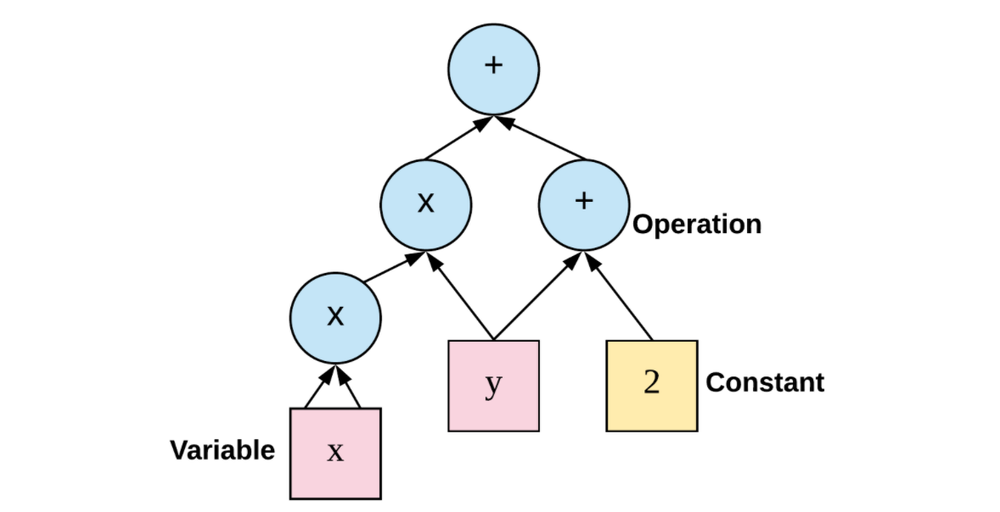
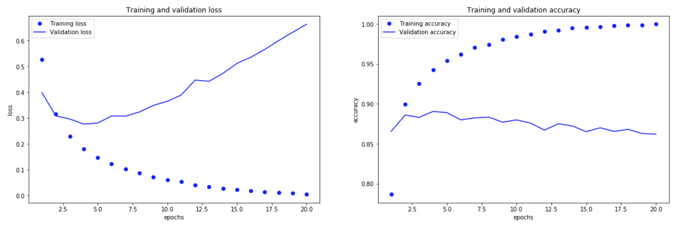
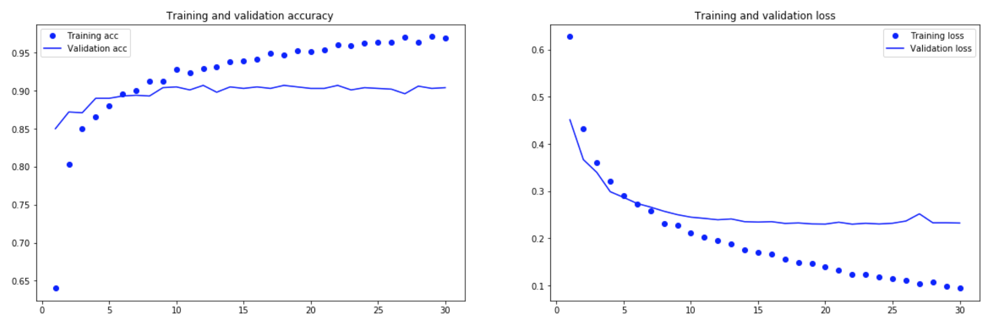

# Keras笔记

* Keras是一个模型级的库，不负责处理张量操作、求微分等运算，交给张量库，也就是Keras的后端引擎 backend engine 来处理。
* 采用 Tensorflow 作为 Keras 的后端引擎，它应用广泛，可扩展性好，可用于生产环境。
* 安装的版本号为
    * tensorflow@1.13.1
    * tensorflow-base@1.13.1
    * tensorflow-estimator@1.13.0
    * keras@2.2.4
    * keras-base@2.2.4
    * keras-applications@1.0.8
    * keras-preprocessing@1.1.0

## Tensorflow基础
* tf基础框架
    * 应用层：提供机器学习相关的训练库、预测库，实现对计算图的构造；
    * 接口层：对tf功能模块的封装，提供调用接口；
    * 核心层，包括：
        * 设备层，支持tf在不同硬件设备上的实现，向上提供统一的接口，实现程序的跨平台功能；
        * 网络层，主要包括RPC和RDMA通信协议，实现不同设备之间的数据传输和更新；
        * 数据操作层，处理张量 tensor，进行张量运算；
        * 图计算层，实现计算图的创建、编译、优化和执行等。

* 计算图，把张量和计算操作作为图的节点，通过有向边连接实现张量的流动。
    * 重点在于，图的定义和图的计算时完全分开的；
    * 需要预先定义各种变量，建立相关的数据流图，在数据流图中创建各种变量之间的计算关系，完成计算图的定义；
    * 然后创建会话 session 对象，在会话中传入输入数据，进行计算，得到输出值。
* 计算流程：
    * 创建 Tensor 变量；
    * 决定变量之间进行的运算；
    * 初始化张量；
    * 创建会话 Session 对象；
    * 在会话中调用 run() 运行计算图。
    * 如果在会话中传入张量的值，需要用 placeholder 初始化，在session中计算的时候，再指定feed_dict传入具体的值，比如 feed_dict={x: 2}
* 基本概念：
    * Session，会话，计算图的具体执行者，与计算图进行交互，一个会话可以包含多个图
    * Tensor，张量，tf中最主要的数据结构，张量的类型包括：
        * Constant，常量，创建常量节点，不会再修改它的值；
            * tf.constant(value, dtype, shape, name='', verify_shape=False)
        * Variable，变量，表示图中的各个计算参数，通过调整这些变量来优化机器学习算法
            * tf.Variable(<initial_value>, name='')
            * 变量的使用必须初始化
            * init = tf.global_variables_initializer()
            * 然后在会话中先执行 session.run(init)
    * Placeholder，占位符，声明数据位置，通过设定 feed_data 传入指定类型和形状的数据，在计算图运行时用获取的数据进行计算，计算完毕后获取的数据就会消失
        * tf.placeholder(dtype, shape, name)
    * Queue，队列，图中有状态的节点，入列返回计算图中的一个操作节点，出列返回一个张量值
    * Operation，操作，是图中的节点，输入和输出都是张量，包括：
        * 初始化，tf.ones(shape), tf.zeros(shape)
        * onehot编码处理，tf.one_hot(labels, depth, axis)
        * 数学运算
            * add, multiply, matmul
            * tf.reduce_mean()，相当于 np.mean()，求均值
        * NN 相关的计算：
        * 激活函数，tf.nn.relu()，tf.nn.sigmoid()
        * 求损失函数，传入最后一层得到的Z[L]和Y即可：
            * tf.nn.sigmoid_cross_entropy_with_logits(logits, labels)

1. 【例】用TF建立3层NN，处理多类别图像识别
* 加载数据并进行数据处理：
    - 加载数据集train_signs, test_signs，识别手比划的数字0到5
        - x_train_org, (1080, 64, 64, 3)，共180\*6个样本，每张照片宽和高为64，3个通道
        - y_train_org, (1, 1080), 每个训练集的样本对应1个结果，数字0到5
        - x_test_org, (120, 64, 64, 3)，共20\*6个样本，y_test_org, (1, 120)
    - 对x进行展开，然后除以255，缩小数据范围
        - x_train (12288, 1080), x_test (12288, 120)
    - 对y进行one-hot编码，扩展其维度
        - y_train (6, 1080), y_test (6, 120)
* 初始化参数，由于创建的是3层网络，所以需要对 W1, W2, W3随机初始化，对b1, b2, b3赋值为0初始化
    * 这里用 get_variable(name, shape, initializer) 创建变量
    * W用的初始器是 tf.contrib.layers.xavier_initializer(seed)
    * b用的初始器是 tf.zeros_initializer()
* 计算FP，输出Z3
* 计算损失函数，输出 cost
* 对于后向传播，创建优化器，指定学习率，明确目标为最小化 cost
* 应用小批量优化方法：
    * 训练轮数for循环，对于当前一轮
    * 根据 batch_size 决定批总数，随机分批，然后对于每一批进行for循环
    * sess.run([optimizer, cost], feed_dict)，计算当前批的损失
    * 将批的损失/批总数，计入当前轮的损失中
* 最后保存训练后的参数，作为返回值。分别再训练集和测试集上，评估模型准确率。

## 基础知识
### 张量
    张量 tensor 是一种数据容器，矩阵是二阶张量，张量是矩阵向任意维度的推广。
* 关键属性：
    * 阶，轴的个数，查看属性 ndim
    * 形状，张量沿每个轴的维度大小（元素个数），查看属性 shape
    * 数据类型，查看属性 dtype
* 张量切片 slice，沿着某个轴截取 [startIdx:endIdx]，表示从该轴的 startIdx 到 endIdx-1 的部分。如果采取了负数索引，就表示到该轴终点的相对位置。
* 张量运算
    * 广播 broadcast，高阶张量和低阶张量相加，会将低阶张量进行广播，添加新的广播轴，使其 ndim 和高阶的相同，然后沿着新轴不断重复，到形状和高阶的相同，最后逐元素计算。
    * 点积运算 tensor product，不是逐元素的乘积，调用方法 np.dot()
    * 张量变形，调用方法 reshape，变形后总元素的个数不变

### 算法描述
* 小批量随机梯度下降，即**小批量SGD**
    * 随机抽取样本x和对应y组成的数据批量
    * 前向传播，得到预测值y_pred
    * 计算损失函数
    * 后向传播，计算梯度
    * 根据梯度更新参数
* 每次迭代在所有数据上运行，称为**批量SGD**

### 计算流程
1. 加载数据集，以第一个例子，识别手写数字为例。
2. 设计网络架构
    * 层layer，是模型的组成构建，从输入数据中提取表示，通过链接多个层，实现渐进式的数据蒸馏 data distillation
    * 在本例中，模型包含2个全连接层FC，第二层是一个10路softmax分类层，返回图像属于各个数字的概率
3. 配置学习过程
    * 损失函数 loss function，训练过程中需要将其最小化，为学习提供反馈信号
    * 优化器 optimizer，决定基于损失函数，如何对网络参数进行更新
    训练和测试过程中需要监控的指标 metrics
4. 调整数据格式
    * 调整输入数据维度和数据格式，准备输出的标签
5. 训练模型
    * 调用 fit() 方法，指定 epochs 和 batch_size
    * 模型不会同时处理整个数据集，而是会拆分成小批量处理，这里批量的尺寸就是 batch_size
6. 评估模型
    * 最后用 evaluate() 方法评估模型在测试集上的表现

### 举例
1. 影评中的感情（正面/负面）——二分类问题
* 加载keras的IMDB数据集，然后进行张量化处理
    * train_data是一个25000维度的一阶向量，采用onehot编码，因为向量的数据范围都在0到9999之间，所以将每一个数扩展为一个长度为10000的数组，除了该数所在的位置取1，其余位置都填充0
    * 处理完之后，训练集为，X (25000, 10000), Y(25000, 1)
* 构建网络
    * 对于输入向量，输出{0, 1}的情况，采用relu激活的全连接层FC的简单堆叠，称之为 Dense，在这种问题上表现很好。
    * 本例中，设计的网络结构是，两层FC，均包含16个单元，采取relu激活函数；最后输出层只有1个单元，采取sigmoid激活函数。
    * 二分分类，最好采取二元交叉熵 binary_crossentropy 作为损失函数
    * RMSprop 是一个常见的优化器
* 方法验证
    * 将测试集留出一部分作为验证集，观察模型的表现；
    * 通过model.fit()训练模型，返回一个History对象，对象成员history是一个字典，包含训练过程中所有的数据。这里键值包含loss, acc, val_loss, val_acc，分别是训练集的损失、准确率，还有验证集的损失、准确率。
    * 从下图的对比可以看出，在 epochs=4 左右，就可以停下来了，否则会出现针对于训练集过拟合的情况。

 

* 模型评估
    * 重新训练模型，设置训练轮数为4，调用evaluate()评估模型在测试集上的表现，准确率达到 87.4%

2. 新闻分类——多分类问题
* 加载keras中的reuters数据集，进行张量化处理后：
    * train_X (8982, 10000)
    * train_Y (8982, 46)
    * test_X (2246, 10000)
    * test_Y (2246, 46)
    * 输出结果为分别属于46个类别的概率，概率之和为1
* 构建网络
    * 本例中，设计的网络结构是，两层FC，均包含64个单元，采取relu激活函数；最后输出层有46个单元，采取 softmax 激活函数。
    * 中间隐藏层的单元数必须大于输出的单元数，否则就会产生信息瓶颈，相当于将信息压缩到维度很小的中间空间，必然会导致模型表现下降。
    * 多分类采取的损失函数为，多类交叉熵 categorical_crossentropy
    * 优化器依然采用 RMSprop
* 方法验证
    * 留出验证集。经验证，经过9轮左右的训练，就会发生过拟合。
* 模型评估
    * 最后在测试集上的表现为，准确率 77.6%

3. 波士顿房价预测——回归问题
* 加载keras中的boston_housing房价数据集：
    * train_X (404, 13)
    * test_Y (102, 13)
    * 然后进行归一化处理，求出训练集的平均值和标准差，将训练集和测试集的数据都减去平均值，再除以标准差。
* 构建网络
    * 本例中，设计的网络结构是，两层FC，均包含64个单元，采取relu激活函数；最后输出层只有1个单元，无激活函数。
    * 损失函数为，均方误差 mse，预测值和真实值误差的平方。
    * 评估标准为，平均绝对误差 mae，预测值和真实值误差的绝对值。
    * 优化器依然采用 RMSprop
* 方法验证
    * 设计K折交叉验证。每次取1/k的数据作为验证集，训练集中剩下的数据作为训练集；
    * 每次都新建模型，然后调用fit()，进行训练，记录下在当前验证集上的表现；
    * 根据验证集的表现，调整训练轮数，避免训练集过拟合。
* 模型评估
    * 最后选择训练轮数为60左右，这是在验证集上表现最好的参数。
    * 在测试集上的表现为，mae=2.64

### 机器学习通用流程
1. 定义问题，收集数据集。
    * 明确输入、输出，和可用数据，假设可用数据包含足够多的信息，可以用于学习输入和输出之间的关系。
    * 注意到，机器学习是基于训练数据中存在的过去的数据，来预测未来，所以未来和过去规律相同时效果更好。
2. 选择衡量指标。
    * 精度，准确率，召回率？
    * 根据业务目标设置衡量指标。
3. 确定评估方法。
    * 留出验证 holdout validation，将训练集数据留出一部分不参与训练，作为验证集；
    * K折验证 k-fold validation，将数据划分为大小相同的K个分区，每次取其中一个作为验证集，进行K次；
    * 重复K折验证 k-fold validation with shuffling，每次划分K个分区之前，都对数据进行打乱，进行P*K次。
4. 准备数据。
    * 格式化为张量；
    * 数据标准化处理；
    * 特征工程。
5. 开发比基准更好的模型。
    * 获得统计功效 statistical power，开发的模型可以打败纯随机基准，比如二分类问题中，acc高于0.5；
    * 配置模型，选择激活函数、损失函数、优化器等。
6. 扩大模型规模，开发过拟合的模型。
    * 添加更多的层，让每一层变得更大，或者训练更多的轮次，直到出现过拟合。
7. 模型正则化与调节超参数。
    * 不断调节模型、训练、在验证集上评估、再次调节模型，重复直到模型达到最佳性能。
    * 正则化：L1 和/或 L2 正则化，或是使用 dropout。
    * 尝试不同的架构：增加或减少层数。
    * 尝试不同的超参数组合，找到最佳配置。
    * 反复做特征工程，添加新特征或删除没有信息量的特征。

## 卷积神经网络
1. 简单CNN —— MNIST数字识别问题

* 这是比较典型的结构，前面采取卷积层+池化层重复的形式，这一部分称为模型的卷积基 convolutional base，然后进行展开，接着几个全连接层，最后是输出分类结果的输出层，这一部分是模型的分类器。
* 在keras中
    * 卷积层，layers.Conv
    * 池化层（最大），layers.MaxPooling
    * 全连接层，layers.Dense
    * 展开层，layers.Flatten
* 卷积层和池化层，需要指定过滤器的尺寸；除了展开层，都需要指定本层所使用的激活函数；
* 最后对于mnist，模型在测试集上的acc=99.11%

2. 数据增强&dropout —— 识别猫狗问题
* 下载Kaggle/dogs-vs-cats问题的数据，取1000张猫的照片作为训练集，500张验证集，500张测试集，狗的照片也一样。
* 建立模型，采取结构为：
    * Conv2D(32, f=3) & MaxPooling2D(f=2)
    * Conv2D(64, f=3) & MaxPooling2D(f=2)
    * Conv2D(128, f=3) & MaxPooling2D(f=2)
    * Conv2D(128, f=3) & MaxPooling2D(f=2)
    * Flatten()
    * Dense(512)
    * 输出层，Dense(1)
* 数据处理
    * 图片格式为jpg，处理的时候有以下步骤：读取图像文件，将文件解码为 RGB 像素网格，将这些像素网格转换为浮点数张量，最后再将像素值(0~255 范围内)缩放到 [0, 1] 区间。
    * 使用 Keras 的 ImageDataGenerator 类，通过生成器进行图片的处理：
        * 调用 flow_from_directory() 方法
        * 指定读取目录，图像目标大小，处理批大小，标签格式等。
* 模型训练
    * 调用 fit_generator() 方法；
    * 指定生成器，以及每轮从生成器中抽取的样本数量 steps_per_epoch，训练轮数 epochs，验证集的生成器和每次抽取的样本数量 validation_steps
* 模型评估
    * 基本上5轮以后就出现了过拟合；

* 数据增强 & dropout 解决过拟合
    * ImageDataGenerator构造参数：
        * rotation_range，图像旋转的角度范围；
        * width_shift/height_shift，图像在水平/垂直方向平移范围；
        * shear_range，图像错切变换角度范围；
        * zoom_range，图像缩放范围；
        * horizontal_flip，水平翻转；
        * fill_mode，填充新创建像素的方法。
    * 对训练集的数据，进行数据增强；
    * 改变模型结构，在展开 Flatten 后增加：
        * layers.Dropout(0.5)
* 再次评估模型
    * 过拟合有了明显改善，acc在训练集和验证集上都保持上涨趋势，训练轮数目前采取的是80，还可以再增加。

3. 迁移学习
* 使用预训练模型（迁移学习），分为两种：
    * 特征提取 feature extraction，复用模型的卷积基。因为卷积基部分学习到的东西更加通用，FC分类器舍弃了空间的概念，学习到的只是某类物体出现在图像中的概率信息。
    * 模型微调 fine-tuning，将卷积基的顶部几层解冻，调节解冻的部分和分类器。因为模型的底部层提取的是高度通用的特征，比如边缘、颜色、纹理等，所以复用时保留底部，只对顶部几层解冻即可。
* 从 keras.applications 中，引入模型 VGG16
    * weights 指定模型初始化的权重检查点
    * include_top，迁移学习中一般选择False，不包含分类器
* 特征提取有两种使用方法：
    * 在数据集上运行卷积基，保存结果为 Numpy 数组，将这个数组作为独立的分类器的输入。优点是速度快，计算开销小，因为只运行了一次卷积基，但是不允许使用数据增强；
    * 在模型顶部添加Dense层，扩展已有模型。可以使用数据增强，但是计算代价高很多。
        * model包括，conv_base, Flatten, Dense(256), Dense(1)
        * 注意需要先设置 conv_base.trainable=False，冻结卷积基的参数；
        * 然后使用数据增强，设置生成器；
        * 最后编译模型，针对生成器进行训练 fit_generator()
    * 模型微调的过程和上面类似，但是要指定卷积基中解冻层，设置好各层的 trainable 属性。
* 这里只对第一种计算开销小的方法进行实验：
    * 保存卷积基训练结果，reshape展开输入的特征；
    * 建立分类器模型：FC(256) + Dropout(0.5) + FC(1)
    * 模型编译，训练（展开的特征作为训练输入）
* 观察结果发现，基本上5轮以后就出现了过拟合，但是到第5轮，验证acc就已经达到了90%以上，相比前面自己建立的模型，还是有很大提升。
* 对于数据量小的数据集，采取数据增强是解决过拟合问题的重要手段。

4. 可视化
* 可视化中间激活
    * 展示1张小猫图片，经过模型前8层处理后，每层的激活输出图像；
        * 处理图片为张量 img_tensor
        * 提取前8层的输入和输出，实例化新的Model
        * 调用 predict() 获得图片张量对应的输出 activations
        * 对于每一层的 activation，输出的一张图片为 (0, :, :, channel)，按频道号依次排列输出。
    * 第一层是各种边缘探测器的集合，这一层的激活几乎保留了原始图像中的所有信息；
    * 随着层数的加深，激活变得越来越抽象。层数越深，其中关于图像视觉内容的信息就越少，关于类别的信息就越多；
    * 激活的稀疏度 sparsity 随着层数的加深而增大；
    * 深度神经网络可以作为有效的信息蒸馏通道 information distillation pipeline，输入原始数据，反复过滤，放大和细化有效信息。
* 可视化过滤器
    * 底层的过滤器对应简单的方向、边缘和颜色；
    * 随着层数加深，出现边缘和颜色组合而成的简单纹理。
    * 再高层的过滤器纹理更加复杂，类似于自然图像中的纹理。
* 可视化类激活图 CAM
    * CAM生成热力图，表示图像每个位置对该类别的重要程度；
    * 应用方法，GradCAM
        * 给定一张输入图像，对于一个卷积层的输出特征图，用类别相对于通道的梯度对这个特征图中的每个通道进行加权。
        * 相当于，用 “每个通道对类别的重要程度” 对 “输入图像对不同通道的激活强度” 的空间图进行加权，从而得到了 “输入图像对类别的激活强度” 的空间图。
    * 通过叠加原始图和热力图，可以看出模型识别出物体的具体位置和判别的重要依据。