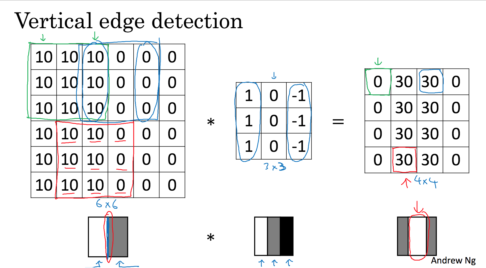

# 物体检测
* 物体检测，是检测图像中，某个类别的对象实例的任务。最新的方法主要分为两类：
    * 一阶段方法，优先考虑模型推理速度，模型主要有YOLO, SSD, RetinaNet
    * 两阶段方法，优先考虑准确率，主要有Faster R-CNN, Mask R-CNN, Cascade R-CNN
* 常用数据集：MSCOCO

以上参考自[网站](https://paperswithcode.com/task/object-detection)

# 深度学习笔记
## 神经网络 Neural Network 基础
* 使用神经网络（简称NN）时，通过设置输入层 input layer，NN自动生成中间的隐藏单元 hidden units，得到输出的预测值
* NN用于监督学习，常见的应用包括：
    * 广告推荐 -> Standard NN
    * 图像识别 -> CNN，处理图像
    * 音频识别，翻译 -> RNN，处理一维的序列化数据
* 数据分类：结构化数据，按表格存储的数据，特征定义十分清晰；非结构化数据，比如图像、音频、文字等。
* 提升NN的表现，主要通过两点：投入更多数据，或者建立更大、更复杂的网络模型。在数据量不大时，各种算法的表现比较接近，模型的最终表现更取决于一些设计细节，只有在处理大数据时，NN才能展现绝对的优势。
### 二分分类
* 用逻辑回归解决二分分类为例
    * 训练集大小为m
    * 输入特征向量x，尺寸为(n, 1)
    * m个x按列摆放得到矩阵X，尺寸为(n, m)
    * 输出预测结果a，以及真实的结果y，都属于{0, 1}。a = P(y=1 | x)，代表对于数据x，预测y为1的可能性
    * 模型参数为w，size=(n, 1)，以及实数b
    * a = sig((w.T)*x + b)，sig是sigmoid函数
    * 损失函数 Loss Function，体现模型预测结果对单个训练数据的偏差，这里记为 L(a, y)
    > L(a, y) = -(yloga + (1-y)*log(1-a))
    * 成本函数 Cost Function，体现模型预测结果对整个训练集的偏差，记为J(w, b)，是在训练集上所有L之和的平均值
* 通过前向传播，从输入向量到损失函数L，构建计算图；然后通过后向传播，求损失函数L对各个变量的偏导，从而通过梯度下降 Gradient Descent，迭代出参数的最优解。
    * dL/da，记作da, da = -y/a + (1-y)/(1-a)
    * z = (w.T)*x = b, dz = a - y
    * dwi = xi * (a - y)
    * db = dz
* 这个过程中，进行向量化十分重要，以避免显式的for循环。
    * 向量的运算相比显式的for循环快很多，使用SIMD (SingleInstructionMultipleData) 采取并行运算。
    * 比如：对于一个1000000*1维度的两个向量相乘，使用for循环大概需要500ms，但是如果使用numpy的函数，dot(x, y)，则只需要1.2ms
* 最终伪代码如下
>
    // 最外层循环，代表迭代次数
    for i in range(times):    
        Z = W.T*X + b = np.dot(W.T, X) + b  
        A = sigmoid(Z)  
        dZ = A - Y  
        dW = 1/m * X * dZ.T  
        db = 1/m * np.sum(dZ)  
    // 梯度下降更新参数，alpha为学习率  
        W := W - alpha * dW  
        b := b - aplha * db  

## 卷积神经网络
### 边缘检测 edge detection
1. 示例

* 使用卷积来检测图像中物体的边缘，比如上图，待检测图像尺寸为(6, 6)，和一个过滤器filter，或称之为核kernel，尺寸为(3, 3)的矩阵做卷积，得到的结果会反应图像中存在的边缘
* 过滤器的选择是关键
    * 垂直边缘检测，[[1,0,-1],[1,0,-1],[1,0,-1]]
    * 水平边缘检测，[[1,1,1],[0,0,0],[-1,-1,-1]]
    * 事实上，调节其中不同的参数，可以检测不同角度的边缘
2. Padding
* 上面那样使用卷积称为 Valid Convolution
    * (n,n) * (f,f) = (n-f+1,n-f+1)
    * 每次使用卷积，图像尺寸都会缩小 shrink
    * 计算过程中，图像边缘只参与了一次运算，而中间参与了多次运算，图像边缘的信息有所丢失
* 如果先进行填充，再使用卷积，使得计算完得到的图像大小不变，称为 Same Convolution
    * (n+2p,n+2p) * (f,f) = (n+2p-f+1, n+2p-f+1)
    * p = (f-1)/2，过滤器的尺寸f基本上都是奇数（否则填充起来不对称，而且奇数更容易找到central pixel）
    * 一般填充0即可
3. Stride
* 过滤器进行卷积时，在图像中移动的步长事实上是可以设置的，记为s
* (n+2p,n+2p) * (f,f) = (1/s*(n+2p-f)+1, 1/s*(n+2p-f)+1)
* 这里的 (n+2p-f)/s，向下取整
4. 维度扩展
* 如果对RGB图像做卷积，需要扩展维度，涉及到一个参数，channels，记作c
* (n,n,c) * (f,f,c) = (n-f+1, n-f+1, 1)
* 过滤器的channels数目必须和图像保持一致，这样卷积完的结果依然是二维的
* 对过滤器的不同频道进行设置，设为0即可过滤掉不关心的频道
* 将使用不同过滤器得到的结果堆叠起来，最后的结果也是三维的，同时展现多个角度的特征
* 补充：以上使用的卷积运算，数学上严格来说，是cross-correlation。数学中的卷积运算需要先将过滤器水平、垂直翻转，再进行上述计算，但是在深度学习中不需要。