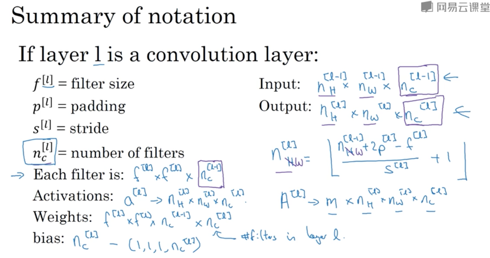

# 物体检测
* 物体检测，是检测图像中，某个类别的对象实例的任务。最新的方法主要分为两类：
    * 一阶段方法，优先考虑模型推理速度，模型主要有YOLO, SSD, RetinaNet
    * 两阶段方法，优先考虑准确率，主要有Faster R-CNN, Mask R-CNN, Cascade R-CNN
* 常用数据集：MSCOCO

以上参考自[网站](https://paperswithcode.com/task/object-detection)

# 深度学习笔记
## 神经网络 Neural Network 基础
* 使用神经网络（简称NN）时，通过设置输入层 input layer，NN自动生成中间的隐藏单元 hidden units，得到输出的预测值
* NN用于监督学习，常见的应用包括：
    * 广告推荐 -> Standard NN
    * 图像识别 -> CNN，处理图像
    * 音频识别，翻译 -> RNN，处理一维的序列化数据
* 数据分类：结构化数据，按表格存储的数据，特征定义十分清晰；非结构化数据，比如图像、音频、文字等。
* 提升NN的表现，主要通过两点：投入更多数据，或者建立更大、更复杂的网络模型。在数据量不大时，各种算法的表现比较接近，模型的最终表现更取决于一些设计细节，只有在处理大数据时，NN才能展现绝对的优势。
### 二分分类
* 用逻辑回归解决二分分类为例
    * 训练集大小为m
    * 输入特征向量x，尺寸为(n, 1)
    * m个x按列摆放得到矩阵X，尺寸为(n, m)
    * 输出预测结果a，以及真实的结果y，都属于{0, 1}。a = P(y=1 | x)，代表对于数据x，预测y为1的可能性
    * 模型参数为w，size=(n, 1)，以及实数b
    * a = sig((w.T)*x + b)，sig是sigmoid函数
    * 损失函数 Loss Function，体现模型预测结果对单个训练数据的偏差，这里记为 L(a, y)
    > L(a, y) = -(yloga + (1-y)*log(1-a))
    * 成本函数 Cost Function，体现模型预测结果对整个训练集的偏差，记为J(w, b)，是在训练集上所有L之和的平均值
* 通过前向传播，从输入向量到损失函数L，构建计算图；然后通过后向传播，求损失函数L对各个变量的偏导，从而通过梯度下降 Gradient Descent，迭代出参数的最优解。
    * dL/da，记作da, da = -y/a + (1-y)/(1-a)
    * z = (w.T)*x = b, dz = a - y
    * dwi = xi * (a - y)
    * db = dz
* 这个过程中，进行向量化十分重要，以避免显式的for循环。
    * 向量的运算相比显式的for循环快很多，使用SIMD (SingleInstructionMultipleData) 采取并行运算。
    * 比如：对于一个1000000*1维度的两个向量相乘，使用for循环大概需要500ms，但是如果使用numpy的函数，dot(x, y)，则只需要1.2ms
* 最终伪代码如下
>
    // 最外层循环，代表迭代次数
    for i in range(times):    
        Z = W.T*X + b = np.dot(W.T, X) + b  
        A = sigmoid(Z)  
        dZ = A - Y  
        dW = 1/m * X * dZ.T  
        db = 1/m * np.sum(dZ)  
    // 梯度下降更新参数，alpha为学习率  
        W := W - alpha * dW  
        b := b - aplha * db  

## 卷积神经网络
### 边缘检测 edge detection
1. 示例

* 使用卷积来检测图像中物体的边缘，比如上图，待检测图像尺寸为(6, 6)，和一个过滤器filter，或称之为核kernel，尺寸为(3, 3)的矩阵做卷积，得到的结果会反应图像中存在的边缘
* 过滤器的选择是关键
    * 垂直边缘检测，[[1,0,-1],[1,0,-1],[1,0,-1]]
    * 水平边缘检测，[[1,1,1],[0,0,0],[-1,-1,-1]]
    * 事实上，调节其中不同的参数，可以检测不同角度的边缘
2. Padding
* 上面那样使用卷积称为 Valid Convolution
    * (n,n) * (f,f) = (n-f+1,n-f+1)
    * 每次使用卷积，图像尺寸都会缩小 shrink
    * 计算过程中，图像边缘只参与了一次运算，而中间参与了多次运算，图像边缘的信息有所丢失
* 如果先进行填充，再使用卷积，使得计算完得到的图像大小不变，称为 Same Convolution
    * (n+2p,n+2p) * (f,f) = (n+2p-f+1, n+2p-f+1)
    * p = (f-1)/2，过滤器的尺寸f基本上都是奇数（否则填充起来不对称，而且奇数更容易找到central pixel）
    * 一般填充0即可
3. Stride
* 过滤器进行卷积时，在图像中移动的步长事实上是可以设置的，记为s
* (n+2p,n+2p) * (f,f) = (1/s*(n+2p-f)+1, 1/s*(n+2p-f)+1)
* 这里的 (n+2p-f)/s，向下取整
4. 维度扩展
* 如果对RGB图像做卷积，需要扩展维度，涉及到一个参数，信道数 channels，记作c
    * (n,n,c) * (f,f,c) = (n-f+1, n-f+1, 1)
    * 过滤器的channels数目必须和图像保持一致，这样卷积完的结果依然是二维的
* 对过滤器的不同信道进行设置，这一层设为0即可过滤掉不关心的信道
* 将使用不同过滤器得到的结果堆叠起来，最后的结果也是三维的，尺寸为(n-f+1, n-f+1, numberOfFilters)
    * ReLU(filter + bias)
    * 例如，使用10个过滤器，图像有3个信道，那么不论图像多大，需要设置的参数数目为(3*3*3 + 1) * 10 = 280，在一定程度上避免了过拟合
* 补充：以上使用的卷积运算，数学上严格来说，是cross-correlation。数学中的卷积运算需要先将过滤器水平、垂直翻转，再进行上述计算，但是在深度学习中不需要。
* 第l层各个参数维度总结
    * 输入，(nH[l-1], nW[l-1], nc[l-1])
    * 输出，(nH[l], nW[l], nc[l])，说明这一层用了nc[l]个过滤器
    * nH[l]和nH[l-1]之间的关系，和本层的padding, stride有关，可进行计算
    * nW[l]和nW[l-1]之间的关系，和本层的padding, stride有关，可进行计算
    * 过滤器，(f[l], f[l], nc[l-1])，和输入的频道保持一致
    * 本层所有参数为：f[l] * f[l] * nc[l-1] * nc[l]，以及nc[l]个偏差值

 

5. 多层卷积网络
* 一般来说，随着层数深入，宽和高逐渐下降，而使用的filters数目增多。最后一层得到的输出展开为长向量，应用分类算法。
* 卷积网络中有3种层：
    * 卷积层 CONV
    * 池化层 POOL，缩减模型大小，提高计算速度，提高提取特征的鲁棒性
    * FullyConnected，常规神经网络
* 池化层只有一些超参数：filter size f, stride s, max/avg
    * max pooling 比 average pooling 更常用
    * 对每个信道逐一进行计算
    * 输入尺寸为 (nH, nW, nc)，则输出尺寸为 (1+(nH-f)/s, 1+(nW-f)/s, nc)
* 举例
    * 类似于LeNet-5的卷积网络模型，实现手写数字识别
    * 起始图像，(32, 32, 3)
    * 第一层（池化层只有超参数，可和卷积层算作一层）
        * CONV1 [f=5, s=1], (28, 28, 6)
        * POOL1 [f=2, s=2], (14, 14, 6)
    * 第二层
        * CONV2 [f=5, s=1], (10, 10, 16)
        * POOL2 [f=2, s=2], (5, 5, 16)
    * 展开得到400个单元，经过第三层FC3，得到120个单元
    * 第四层FC4，84个单元
    * 应用softmax算法，输出分类结果
* 卷积网络的优点包括：
    * 参数共享。过滤器用于提取特征，如果在图像的某一部分提取效果很好，那么很可能在其他部分效果也很好。卷积网络的参数较少，正是由于在图像的不同位置共享了同样的过滤器。
    * 稀疏连接。输出值，只和输入的很小一部分值相关。
    * 平移不变 translation invariance，这也和卷积相关。