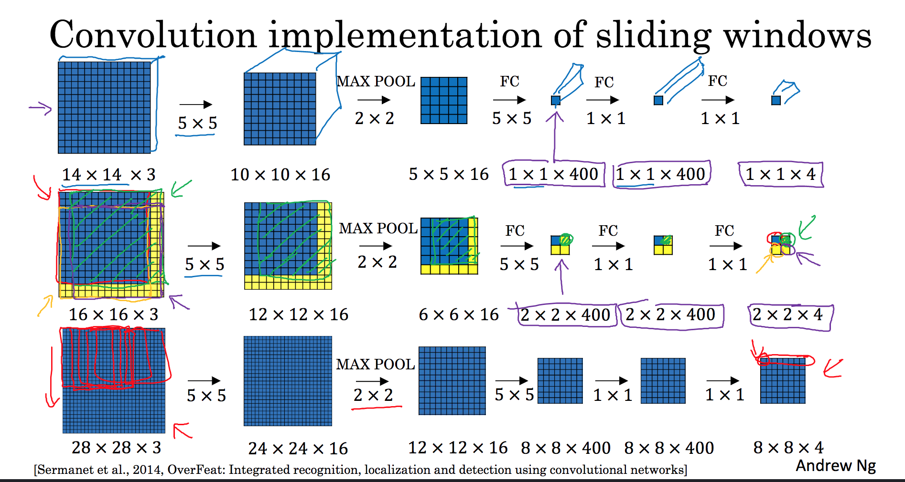

# 物体检测
* 物体检测，是检测图像中，某个类别的对象实例的任务。最新的方法主要分为两类：
    * 一阶段方法，优先考虑模型推理速度，模型主要有YOLO, SSD, RetinaNet
    * 两阶段方法，优先考虑准确率，主要有Faster R-CNN, Mask R-CNN, Cascade R-CNN
* 常用数据集：MSCOCO

以上参考自[网站](https://paperswithcode.com/task/object-detection)

## 基础知识
### 物体定位 Object localisation
    物体定位问题，是指图片中有一个物体在居中的位置，任务是识别出物体的种类（Classification），并且框出来（Localisation）
    具体实现：
    图片经卷积网络ConvNet，展开成列向量，然后应用softmax实现图片的分类，应用其他算法模型输出物体位置
    物体位置可以表示为(bx, by, bw, bh)，bx，by定位物体中心点在图片中的位置，bw，bh表示图片的宽和高
    所以最终输出的结果形式为，y = ([Pc], [bx], [by], [bw], [bh], [c1], [c2], ...)
        Pc表示图片中是1否0存在目标物体
        bx, by, bw, bh是对物体的定位
        ci代表具体的第i类，表示物体是否属于这个具体的分类

### 关键点提取
    输出层除了输出物体的类别和位置，还能输出物体关键点的位置，这些关键点称之为landmarks
    每个关键点由点在图片中的横纵坐标x，y表示。关键点作为特征，一般需要对数据进行手动标识，注意要在数据集上保持一致性，比如：人脸识别中，设置(lx1, ly1)为左眼眼角的点，那么需要将所有图片中，人脸上左眼眼界的点标记出来，提取坐标记作lx1, ly1

### 滑动窗口
1. 滑动窗口检测 Sliding Window Detection
* 先用适当剪裁好的图像（目标物体如果存在，基本上充满图像），训练卷积网络，得到可以判断目标是否存在的模型；
* 然后设置一个窗口，从左到右，从上到下，以设置好的步长，滑动遍历图像，将窗口内截取的图片传入上面的模型，即可判断当前窗口是否存在目标物体。
* 问题在于：窗口和步长设置过大时，粒度太大，影响准确率；但是窗口和步长过小，会导致计算成本太高。

2. 卷积滑动窗口 Convolutional Implementation of Sliding Windows

* 全连接层看作卷积层：比如上一层输出的尺寸为 (5, 5, 16)，原本的全连接层将其展开，得到 (400, 1) 的列向量，但如果将这一层看做是卷积层，f=5，numOfFilters=400，则可以得到 (1, 1, 400) 的尺寸，且算法的含义其实和全连接层相同。
* 举例：
    * 如果一开始训练的图像尺寸为 (14, 14, 3)，经过卷积层、池化层、全连接层，最后得到 (1, 1, 4) 表示分类结果
    * 那么对于一个 (16, 16, 3) 的图像，采取的步长为2，14*14 的滑动窗口可以截取4次。但如果单独截取这4个窗口，分别输入上面得到的模型，其实计算出现大量重复
    * 所以将 (16, 16, 3) 直接输入模型，最后得到的结果是 (2, 2, 4)，这其中每一个 1\*1\*4 的小立方体，都代表了一个截取窗口的分类结果。
    * 这里窗口移动的步长，是由中间的池化层，MAX-POOL决定的
* 所以卷积移动窗口，为了降低计算成本，不是先通过窗口移动截取再输入模型，而是直接将图片输入模型，然后从输出结果看每个窗口的分类结果
* 存在的问题：物体的边框 bounding box 不够精确

### 交并比函数 Intersection over Union
    交并比函数（IoU）常用来判断物体边框的标注是否准确。
    实际边框为actual_box，预测结果为pred_box
    则
        IoU = (actual_box ∩ pred_box) / (actual_box ∪ pred_box)
    一般来说，IoU需要高于0.5，才能认为标注正确；或者可以提高这个阈值，采取更为严格的标准。

### YOLO (You Only Look Once)
* 解决卷积滑动窗口中，边框不够精确的问题，而且计算成本较低，可以实现实时识别。
* 算法流程：
    * 将图片划分成方格 grids，比如 19\*19，那么设计卷积网络， 使得最后输出的形式是 19\*19\*ny，每个 1\*1\*ny 的立方体代表一个方格的识别结果；
    * 方格中是否存在物体，其实是看物体的中心点是否落在这个方格中；
    * 一个方格的左上角记作 (0, 0)，右下角记作 (1, 1)，所以物体的中心点 (bx, by) 坐标在0到1中间，物体的宽 bw 和高 bh，表示物体的实际宽（高） / 方格的宽（高）
* 非极大值抑制 non-max depression：
    * 可能出现多个格子都觉得自己检测到了物体的情况，那么需要用非极大值抑制，确保一个物体只检测了一次。
    * 流程如下。对于输出单元，丢弃pc过小的，比如小于0.6的（没有检测到物体）；然后选取剩下的边框中，pc最大的，丢弃所有和这个边框IoU过高的边框；然后重复上一步选取、丢弃，直到处理完所有结果。
    * 如果设计到多类分类问题，那么需要对每一个类别，分别应用非极大值抑制。
* anchor box
    * 解决两个物体的中心点落在了一个方格内的问题；
    * 针对目标物体，设置不同形状的 anchor boxes，输出的y大小为 grids \* grids \* anchorBoxes \* ny
    * 每个 anchor box 在输出中，有独立的Pc，边框，以及类别，这样一个方格就可以同时表示多个物体；
    * anchor box 的形状可以自己手动设置，也可以用 k-means 聚类，自动得出；
    * 但是该方法解决不了，形状类似的物体重叠问题。

### Region Proposal: R-CNN
* 核心思想是，在进入卷积网络之前，先进行一次筛选，选出更有可能的 regions 输入，降低计算开销；
* 基本流程是：运行分割算法 segmentation algorithm，选出图像中和目标物体更为接近的色块所在的候选区域，然后对候选区域逐一运行分类器算法，输出分类的结果和物体边框。
* 问题在于，速度过慢。提速的方法有：
    * 对候选区域，运行卷积滑动窗口；
    * 使用卷积神经网络来选取候选区域。