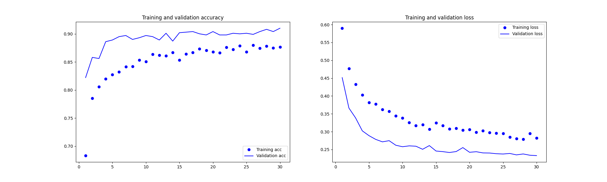

# 环境部署
## 基本流程
1. 登录ssh
2. 查看已有镜像，如有需要新建镜像
3. 根据镜像新建容器 or 启动已有容器
    * 容器一般挂载服务器指定文件夹，这样即使关闭了容器，在容器里对文件作出的修改也都会保留下来
>
    docker run -it jyy/test_env:latest bash
    
    // 设置参数
    终端交互：-it
    挂载：-v /home/jyy/test:/workspace/test
    指定gpu： --gpus 1
    指定网络：--network host --ipc=host
    指定镜像（image: tag）：jyy/test_env:latest

    // 查看容器id
    docker ps -a
    // 启动停止的容器
    docker start containerId
    // 连接容器，开始交互  
    docker exec -it containerId bash
4. 在容器中，运行py文件（pip 安装缺失的依赖包），结束后exit退出
5. 如有需要，可用容器更新镜像

## SSH
* 登录
> 
    ssh jyy@remote_address

* 上传本地文件（夹）
>
    scp (-r) local_path jyy@remote_address:remote_path

* 下载服务器文件（夹）
>
    scp (-r) jyy@remote_address:remote_path local_path

* 退出登录 
    * exit
    * 一段时间没有操作自动退出 -> Broken pipeline

## Docker
* 查看镜像，docker images
* 查看（历史）容器，docker ps (-a)
* 更新镜像
> 
    // container更新，退出后
    docker commit -m "update msg" -a="jyy" [containerId] jyy/test_env:latest
* 构建镜像，使用文本文件 Dockerfile，含构建镜像所需的指令和说明。注意到 Dockerfile 的指令每执行一次都会在 docker 上新建一层，所以尽量用 && 合并RUN；
    * FROM 基础镜像
    * RUN shell命令 or ["filename", "arg1", "arg2"]
    >
        docker build -t newImage .
                        新镜像:标签 | 上下文路径
        // 以下提示说明构建成功
        // successfully built ...
        // successfully tagged ...
    * COPY 源路径 目标路径
        * 复制指令，从上下文路径复制文件（夹）到容器指定路径
        * 源路径可以使用通配符，目标路径若不存在会自动创建
    * ADD 源路径 目标路径
        * 和 COPY 类似，但是对于压缩文件（gzip, bzip2, xz）会自动解压
    * CMD shell命令
        * 类似于 RUN，用于运行指令，但是在 docker run 时执行，RUN 在 docker build 时执行
        * 为已经启动的容器指定默认运行的程序
        * 多个 CMD 指令，只有最后一个生效
    * ENTRYPOINT
        * 类似 CMD，但是运行用到的参数可以在 docker run 时传入
        * 同样的，多个指令只有最后一个生效
    * ENV key value
        * 设置环境变量，后续指令都能使用
    * ARG arg=default_value
        * 与 ENV 类似，但是设置的变量只在 build 过程中有效，构建好的镜像内不存在
    * VOLUME path
        * 定义匿名数据卷，启动容器时如果没有挂载，就会自动挂载到匿名数据卷
        * docker run -v 可以修改挂载点
    * EXPOSE port_number
        * 声明端口号，方便配置映射
        * docker run -P 会自动映射到这个端口
    * WORKDIR directory_path
        * 指定工作目录，必须是提前创建好的
        * 在镜像中每一层都存在
    * USER 用户名:用户组
        * 指定执行后续命令的用户和用户组（提前存在）
    * HEALTHCHECK，指定某个程序/指令，监控容器的运行状况
    * ONBUILD，指令在构建镜像的时候不会执行，如果有新的镜像基于本镜像构建（FROM），才会执行 ONBUILD 里面的指令

## 实践
### 1. tf+da
    二分类识别猫狗问题；
    数据量不大，训练集2000个样本，验证集1000个样本；
    迁移学习，用VGG16做特征提取，训练2层FC；
    使用数据增强解决过拟合问题。
* 代码[链接](../pys/tf_with_da.py)
* 结果展示

* 总体准确率较高，但是验证集表现明显好于训练集 -> 过拟合问题依然存在。