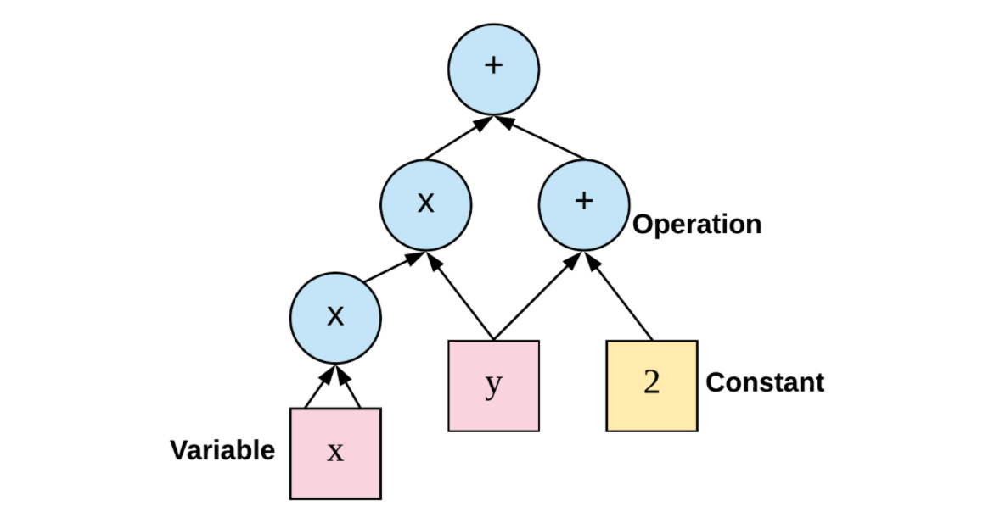

## Tensorflow基础
* tf基础框架
    * 应用层：提供机器学习相关的训练库、预测库，实现对计算图的构造；
    * 接口层：对tf功能模块的封装，提供调用接口；
    * 核心层，包括：
        * 设备层，支持tf在不同硬件设备上的实现，向上提供统一的接口，实现程序的跨平台功能；
        * 网络层，主要包括RPC和RDMA通信协议，实现不同设备之间的数据传输和更新；
        * 数据操作层，处理张量 tensor，进行张量运算；
        * 图计算层，实现计算图的创建、编译、优化和执行等。

* 计算图，把张量和计算操作作为图的节点，通过有向边连接实现张量的流动。
    * 重点在于，图的定义和图的计算时完全分开的；
    * 需要预先定义各种变量，建立相关的数据流图，在数据流图中创建各种变量之间的计算关系，完成计算图的定义；
    * 然后创建会话 session 对象，在会话中传入输入数据，进行计算，得到输出值。
* 计算流程：
    * 创建 Tensor 变量；
    * 决定变量之间进行的运算；
    * 初始化张量；
    * 创建会话 Session 对象；
    * 在会话中调用 run() 运行计算图。
    * 如果在会话中传入张量的值，需要用 placeholder 初始化，在session中计算的时候，再指定feed_dict传入具体的值，比如 feed_dict={x: 2}
* 基本概念：
    * Session，会话，计算图的具体执行者，与计算图进行交互，一个会话可以包含多个图
    * Tensor，张量，tf中最主要的数据结构，张量的类型包括：
        * Constant，常量，创建常量节点，不会再修改它的值；
            * tf.constant(value, dtype, shape, name='', verify_shape=False)
        * Variable，变量，表示图中的各个计算参数，通过调整这些变量来优化机器学习算法
            * tf.Variable(<initial_value>, name='')
            * 变量的使用必须初始化
            * init = tf.global_variables_initializer()
            * 然后在会话中先执行 session.run(init)
    * Placeholder，占位符，声明数据位置，通过设定 feed_data 传入指定类型和形状的数据，在计算图运行时用获取的数据进行计算，计算完毕后获取的数据就会消失
        * tf.placeholder(dtype, shape, name)
    * Queue，队列，图中有状态的节点，入列返回计算图中的一个操作节点，出列返回一个张量值
    * Operation，操作，是图中的节点，输入和输出都是张量，包括：
        * 初始化，tf.ones(shape), tf.zeros(shape)
        * onehot编码处理，tf.one_hot(labels, depth, axis)
        * 数学运算
            * add, multiply, matmul
            * tf.reduce_mean()，相当于 np.mean()，求均值
        * NN 相关的计算：
        * 激活函数，tf.nn.relu()，tf.nn.sigmoid()
        * 求损失函数，传入最后一层得到的Z[L]和Y即可：
            * tf.nn.sigmoid_cross_entropy_with_logits(logits, labels)

* 【例】用TF建立3层NN，处理多类别图像识别
* 加载数据并进行数据处理：
    - 加载数据集train_signs, test_signs，识别手比划的数字0到5
        - x_train_org, (1080, 64, 64, 3)，共180\*6个样本，每张照片宽和高为64，3个通道
        - y_train_org, (1, 1080), 每个训练集的样本对应1个结果，数字0到5
        - x_test_org, (120, 64, 64, 3)，共20\*6个样本，y_test_org, (1, 120)
    - 对x进行展开，然后除以255，缩小数据范围
        - x_train (12288, 1080), x_test (12288, 120)
    - 对y进行one-hot编码，扩展其维度
        - y_train (6, 1080), y_test (6, 120)
* 初始化参数，由于创建的是3层网络，所以需要对 W1, W2, W3随机初始化，对b1, b2, b3赋值为0初始化
    * 这里用 get_variable(name, shape, initializer) 创建变量
    * W用的初始器是 tf.contrib.layers.xavier_initializer(seed)
    * b用的初始器是 tf.zeros_initializer()
* 计算FP，输出Z3
* 计算损失函数，输出 cost
* 对于后向传播，创建优化器，指定学习率，明确目标为最小化 cost
* 应用小批量优化方法：
    * 训练轮数for循环，对于当前一轮
    * 根据 batch_size 决定批总数，随机分批，然后对于每一批进行for循环
    * sess.run([optimizer, cost], feed_dict)，计算当前批的损失
    * 将批的损失/批总数，计入当前轮的损失中
* 最后保存训练后的参数，作为返回值。分别再训练集和测试集上，评估模型准确率。

## 实验
1. 图像分类
Model: VGG16 (not pretrained)
Dataset: Cifar 10 – 60000 Images in 10 classes 
Training: 50000 images (batch: 64, shuffled) 
Test: 10000 images (batch: 128, not shuffled) 
Image size: 3\*32\*32, normalized value: [0, 1]
Learning rate: 0.0001 (Adam optimizer) 
Number Epoch: 30

2. 文本处理
Model: Bi-LSTM
Dataset: IMDB 50k movie reviews
Training: 25k reviews
Test: 25k reviews 
Learning rate: 0.0001
Epoch: 20
Batch size: 64
Vocabulary: 32K
Word embedding dimension: 64

Acc on test set
training/test time