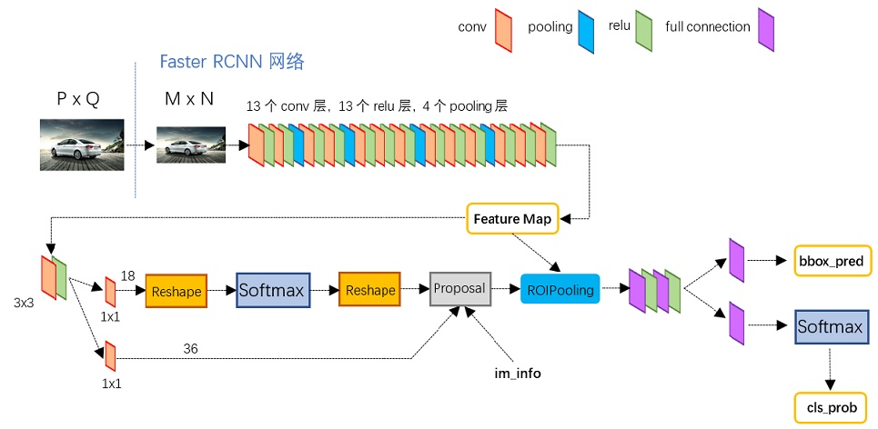

# R-CNN
[开源链接](https://github.com/facebookresearch/Detectron.git)

## [2013] R-CNN: Rich feature hierarchies for accurate object detection and semantic segmentation
[下载链接](https://arxiv.org/abs/1311.2524)
### 算法简述

* 总流程如上，对于输入的图片，先选出候选区域，然后缩放候选区域到固定大小，输入CNN提取特征向量，再由分类/回归模型，得到最终的分类结果和物体边框。
* 模型共有3个模块组成
    * 第一个模块生成和类别无关的区域提议 Region Proposals；
        * 通过 Selective Search 实现
    * 第二个模块是一个卷积神经网络，用于从每个区域中提取一个固定长度的特征向量；
        * 采取深度学习框架 Caffe
        * 先将候选区域缩放为固定大小 (227, 227, 3)，然后输入网络 (5xCONV + 2xFC)，最后得到长度为4096的特征向量
    * 第三个模块是一组用于分类的线性SVM，还有用于预测物体边框的回归算法 Bounding Box Regression
    * 原文中CNN仅用于提取特征，用单独的模型做分类和回归。也可以进行改进，只使用一个 CNN 完成所有的工作。

#### 选择性搜索 Selective Search
* 区域提议，是在训练之前，将图像划分为一些小的区域；
* 一张图像中包含的信息非常丰富，图像中的物体有不同的形状、尺寸、颜色、纹理，物体间还有层次 hierarchical 关系，这些在做区域划分时都需要进行考虑；
* 核心算法
    - 分层分组算法 Hierarchical Grouping Alg
        - 对于一张输入的彩色图片，先进行区域划分；
        - 然后对于每两个相邻的区域，计算其相似度；
        - 对于相似度最高的一对相邻区域进行合并，计算新合并出来的区域和相邻区域的相似度；
        - 重复上面的步骤直到整张图片，输出物体的可能位置。
    - 多样化策略 Diversification Strategies
        - 使用不变性的多种颜色空间应用在分层分组算法；
        - 衡量相似度时，综合计算颜色、纹理、尺度和形状的相似度；
        - 改变初始化区域的划分。

#### AlexNet
* R-CNN 使用的卷积神经网络，可以是 AlexNet
* AlexNet由5个卷积层，2个全连接层组成
    - 起始图像 (227, 227, 3)
    - CONV_1 [11x11, s=4, f=96] (55, 55, 96)
    - MAX-POOL_1 [3x3, s=2] (27, 27, 96)
    - CONV_2 [5x5, f=256, p=same] (27, 27, 256)
    - MAX-POOL_2 [3x3, s=2] (13, 13, 256)
    - CONV_3 [3x3, f=384, p=same] (13, 13, 384) 
    - CONV_4 [3x3, f=384, p=same] (13, 13, 384) 
    - CONV_5 [3x3, f=256, p=same] (13, 13, 256)
    - MAX-POOL_3 [3x3, s=2] (6, 6, 256) ，展开得到 9216 个单元
    - FC_1 (4096, 1)
    - FC_2 (4096, 1)
    - 应用分类器

## [2015] Fast R-CNN
[论文链接](../papers/fast_r-cnn.pdf)
* R-CNN 训练分为多个步骤；如果采取规模较大的 CNN，比如 VGG16，那么不仅训练时间长，而且由于需要将特征向量先存储起来，占用的空间也大；最后物体检测很慢，卷积网络使用 VGG16 的情况下，一张图片需要检测47秒。
* R-CNN 慢的主要原因是，各候选区域独立进行特征提取，这个过程中大量计算重复了。
* SPPnet 对此做出了改进，先计算整张图片的卷积特征图，然后对候选区域进行分类和提取特征向量。但是 SPPnet 依然是一个多步骤算法。

### 算法简述

* Fast R-CNN 的基本流程如下：
    * 将图像和一组对象提议 Object Proposals 作为输入；
    * 先使用几个卷积层和最大池化层处理，得到特征图；
    * 然后对于每个对象提议，都通过RoI (Region-of-Interest) 层，提取固定长度的特征向量；
    * 特征向量都输入一组全连接层，最后到两个同级输出层，一个输出分类的概率（所有类别+背景类），另一个输出每个类别的边框信息。
* RoI
    * 负责将候选区域映射到更小的特征图上；
    * 由 (r, c, h, w) 定义，r和c是左上角的顶点坐标，h和w是窗口的高和宽；
    * 超参数 H, W，用 HxW 的小窗口，划分整个的 hxw，每个小窗口内通过最大池化得到输出。

### 问题
* SPPnet 为什么不能通过微调修改卷积层参数？

## [2015] Faster R-CNN
* 致力于改进区域提议算法，提出用一个卷积神经网络做区域提议，RPN - Region Proposal Network
* 常见的区域提议算法有：
    * 选择性搜索 SS，问题在于速度较慢，用CPU实现每张图片需要2秒
    * EdgeBoxes，在质量和速度之间做了权衡，每张图片只需要0.2秒，但是对于物体检测来说还是略慢

* Faster R-CNN 的基础结构如上
    * 基础的卷积网络（卷积层+池化层），提取出图像的特征图；
    * RPN 通过特征图，生成区域提议；
    * 区域提议和特征图都输入 RoI Pooling，得到 proposal feature maps
    * 最后计算类别，以及对边框进行调整。
* 相当于结合了 RPN 和 Fast R-CNN，但是无法整合到一个网络里，通过bp一次优化。（因为 Fast R-CNN 依赖于固定的区域提议，如果一边训练参数，一边修改提议，不知道是否还能收敛？）

### 补充：边界框回归 Bounding Box Regression
* 对于一个窗口 (x, y, w, h)，分别表示窗口中心点的横纵坐标、窗口的宽和高；
> 
    // 先验框/锚框 
    A = (Ax, Ay, Aw, Ah)
    // 物体真实的边界框
    GT = (Gx, Gy, Gw, Gh)
    // 寻找一种变换F使得
    F(A) = (Gx', Gy', Gw', Gh') ≈ GT
    // F - 平移
    Gx' = Ax + dx(A)*Aw
    Gy' = Ay = dy(A)*Ah
    // F - 缩放
    Gw' = Aw * exp(dw(A))
    Gh' = Ah * exp(dh(A))
    /*
    A和GT之间真实的变换量是 (tx, ty, tw, th)，
    预测的变换量是 (dx(A), dy(A), dw(A), dh(A))
    */
    // W*是需要学习的参数，Φ(A)是先验框对应的特征图向量
    d*(A) = W*.T Φ(A)
* 只有在A和GT相差不大的情况下，才能使用线性回归；
* 对于变换量，定义4个参数
> 
    // anchor box: xa, ya, wa, ha
    // prediction box: x, y, w, h
    tx = (x - xa)/wa
    ty = (y - ya)/ha
    tw = log(w/wa)
    th = log(h/ha)
* 对于边界框回归，输入边界框对应的特征图向量
    * 训练时，目标是缩小(tx, ty, tw, th)和真实的变换值之间的差距 -> smooth-L1损失函数
    * 用于检测时，直接输出先验框应该采取的变换量（平移量+缩放尺度），用于修正先验框。

### Faster R-CNN with VGG16
[参考解析](https://zhuanlan.zhihu.com/p/31426458)
#### 网络结构

* Conv layers
    * 共有13个卷积层 + 4个池化层
    * 所有的卷积层，都是3x3卷积核，s=1，p=1，采取 same padding；
    * 所有的池化层，都是2x2的，s=2，所以每过一次池化层，图像的宽和高都缩小一半；
    * 所以对于 MxN 的输入，输出为 M/16 x N/16

* RPN 
1. 先是一个 3x3 的卷积层，然后每个格子都会对k个先验框做出预测 -> 分类层 cls 2xk，回归层 reg 4xk
    * 注意到在文章中，采取了一个 3x3 的滑动窗口，每个窗口对k个先验框做预测；
    * 先验框以格子/滑动窗口的中心为中心，有两个参数：scale，表示先验框的大小尺度，这里取3，即每个同样形状的先验框有3个不同的大小；ratio，与先验框形状有关，是宽/高，这里也取3；
    * 所以 num of anchors = k = 3 x 3 = 9；
    * 相比MultiBox，这种选择先验框的方法具有平移不变性，大大降低了参数的数量。
2. 对先验框 anchors 进行分类，存在/不存在目标物体 positive/negative
    * 给一个先验框分类为正，条件是：先验框和真实边框的交并比是所有先验框里最高的，或者，和任意真实边框的交并比高于 0.7；
    * 如果一个非正的先验框，和真实边框的交并比都小于 0.3，则分类为负；
    * 一个真实边框可能会对应多个正先验框；有的先验框可能非正非负，对于当前训练可以直接忽略掉。
3. 对先验框应用边界框回归，计算先验框需要进行的平移量&缩放尺度
 
    * 上面是需要最小化的损失函数
    * pi是预测存在物体 positive 的可能性，pi*是真实值 {0, 1}，分类损失和两个类别都相关；
    * 偏差值相关的4个参数ti，如上文边界框回归中解释的含义；
    * 计算回归损失时，乘上 pi*，意味着只对真正包含物体的先验框计算回归损失，这里采取的是smooth-L1；
    * 最后都除以N做归一化处理，加上一个平衡参数λ
4. 最后Proposal层，负责做出区域提议（positive anchors + bounding box regression），处理超出边界的、太小的提议
    * Proposal层输入：分类结果，变换量结果，以及 im_info = [M, N, scale_factor]
    * 然后进行处理：生成先验框，计算边界框回归进行修正；将先验框按照positive的得分排序，留下前topN个；剪裁超出图像边界的，以及尺寸非常小的提议边框；对剩余提议边框应用非最大值抑制；最后输出提议边框 (x1, y1, x2, y2)；
    * 判断图像边界时，需要映射回原图判断。超出边界的提议会导致很难修正的错误，破坏收敛性，所以必须进行剪裁；
    * 最后输出的是提议是在 MxN 图像中，边框左上角和右下角的坐标。

* RoI Pooling
    * 主要是为了解决提议的候选区域大小不一致问题；
    * 先将提议区域映射到特征图 [M/16 x N/16] 上；
    * 然后对于提议的区域，划分成 pooled_w x pooled_h 个格子，每个格子进行最大池化；
    * 最后不论候选区域大小，输出的特征向量长度都是 pooled_w x pooled_h

* Classification
    * 堆叠FC层，用sofmax计算分类概率 cls_prob，再次利用边界框回归计算边框的偏移量 bbox_pred

#### 训练过程
1. 导入 ImageNet 预训练好的CNN参数（ZF, VGG...），初始化卷积部分，然后训练 RPN 网络；
2. 用 RPN 提出的候选区域，训练 Fast R-CNN 检测网络，该检测网络初始化也是采取 ImageNet 预训练参数；
3. 用2训练好的参数，去初始化 RPN 训练的卷积网络，然后冻结其他参数，对 RPN 独有的部分再次进行训练，此时 RPN 和 Fast R-CNN 就共享了卷积层参数。
4. 最后，微调 Fast R-CNN 的全连接层。

## Faster R-CNN in PyTorch
[github链接](https://github.com/facebookresearch/detectron2.git)  
[PyTorch官方代码](https://pytorch.org/docs/stable/_modules/torchvision/models/detection/faster_rcnn.html#fasterrcnn_resnet50_fpn)  
1. FasterRCNN 首先继承自 GeneralizedRCNN，主要接口有
    * transfrom: 标准化图片像素值，缩放 orginal_img_size 到 img_size
    > 
        imgs, targets = transform(imgs, targets)
    * backbone: 主要的卷积部分，常采用VGG, ResNet等常见的CNN模型，输出特征图
    > 
        features = backbone(imgs.tensors)
    * rpn: 产生区域提议的卷积网络
    > 
        proposals, proposal_losses = rpn(imgs, features, targets)
    * roi_head: roi池化层 + 分类
    > 
        detections, detector_losses = roi_heads(features, proposals, img_sizes, targets)
    * postprocess: 进行非最大值抑制，将边界框映射回原图
    > 
        detections = postprocess(detections, img_sizes, original_img_sizes)
2. FasterRCNN 基本信息
    * inputs & outputs
        * 输入图片表示为张量的形式： [C, H, W]
        * 训练过程中，需要输入图片以及对应的 targets: {boxes, labels}，边界框表示为 (x1, y1, x2, y2)，是左上角和右下角的坐标
        * 使用模型进行推断时，只需要输入图片，输出预测结果 {boxes, labels, scores}
    * args
        * backbone(nn.Module)，输出特征图，属性 out_channels 对应输出特征的通道数
        * num_classes(int)，输出的类别总数，包括背景类
        * min_size(int), max_size(int)，划定了输入 backbone 的大小范围
        * image_mean (Tuple[float, float, float]), image_std (Tuple[float, float, float])，用于输入图片归一化，指定了归一化处理后的均值和偏差值
        * rpn_anchor_generator (AnchorGenerator)，根据特征图生成先验框
        * rpn_head (nn.Module)，计算先验框的分类（有无物体）和偏移量
        * rpn_pre_nms_top_n_train (int), rpn_pre_nms_top_n_test (int)，训练/测试中，应用NMS前，保留的提议数量
        * rpn_post_nms_top_n_train (int), rpn_post_nms_top_n_test (int)，训练/测试中，应用NMS后，保留的提议数量
        * rpn_nms_thresh (float)，postprocess 中，应用NMS时采取的阈值
        * rpn_fg_iou_thresh (float), rpn_bg_iou_thresh (float)，anchor 认定为 positive/negative 时，和真实边框的最小/大交并比
        * rpn_batch_size_per_image (int)，训练RPN时，每个mini-batch的先验框数量
        * rpn_positive_fraction (float)，每个mini-batch中，分类为正的比例
        * box_roi_pool (MultiScaleRoIAlign)，根据边界框剪裁和缩放特征图
        * box_head (nn.Module)，输入剪裁好的特征图
        * box_predictor (nn.Module)，输出分类和回归结果
        * box_score_thresh (float)，筛选提议的置信阈值
        * box_nms_thresh (float)，做预测时，应用NMS的阈值
        * box_detections_per_img (int)，每张图片能做出的最大检测数量
        * box_fg_iou_thresh (float), box_bg_iou_thresh (float)，proposal 认定为 positive/negative时，与真实边框的最小/大交并比
        * box_batch_size_per_image (int)
        * box_positive_fraction (float)
        * bbox_reg_weights (Tuple[float, float, float, float])，边界框编码/解码的权重
3. Faster R-CNN 重要设计    
    * backbone 默认采取 ResNet50 + FPN
    * rpn_anchor_generator -> AnchorGenerator
        * grid_anchors()
    * rpn_head
    * RegionProposalNetwork
    * roi_heads
    * MultiScaleRoIAlign -> roi_pooling
    * TwoMLPHead