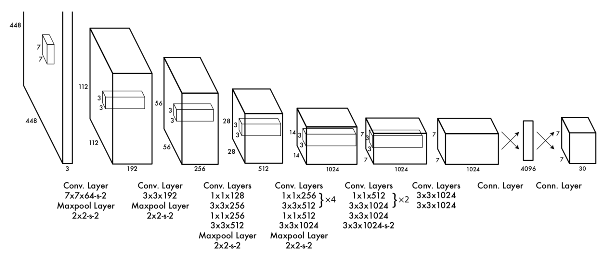
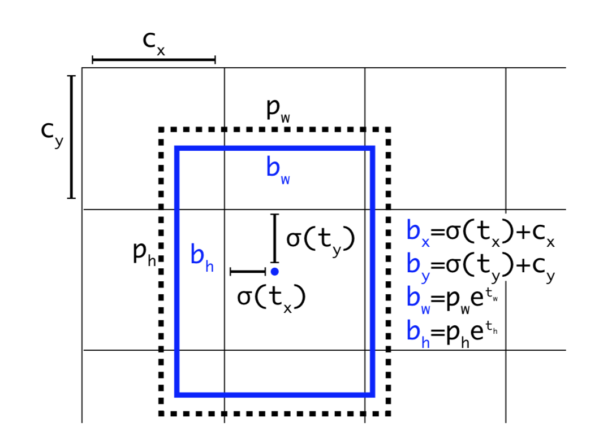
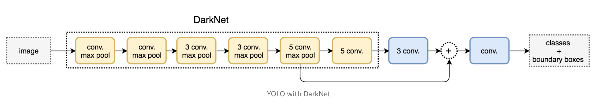
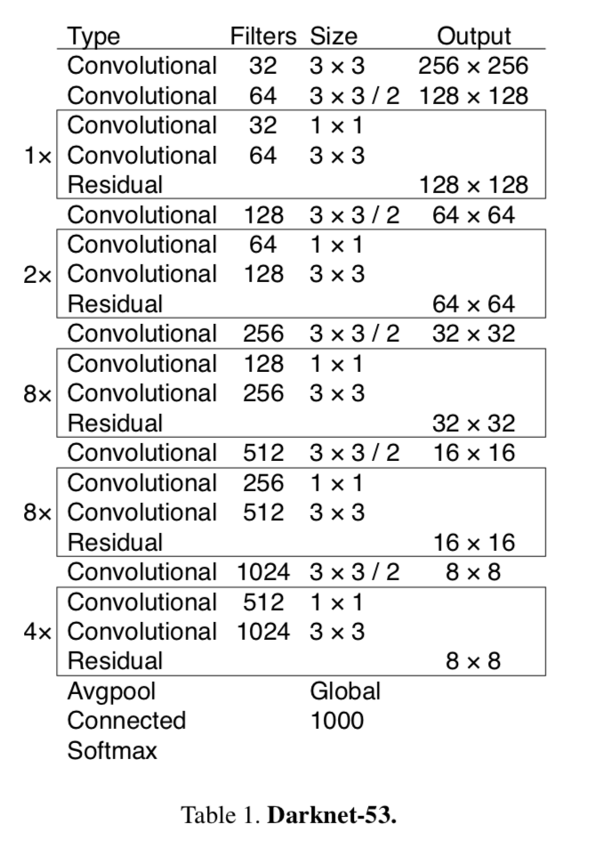
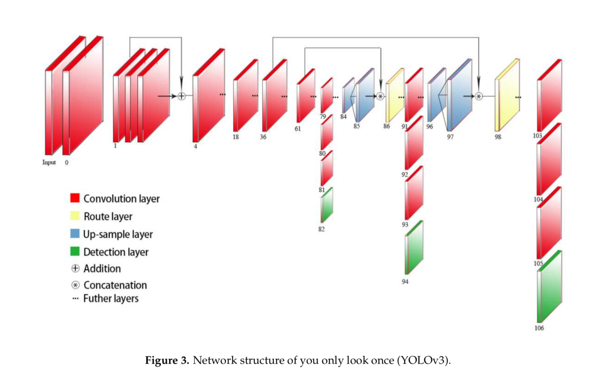
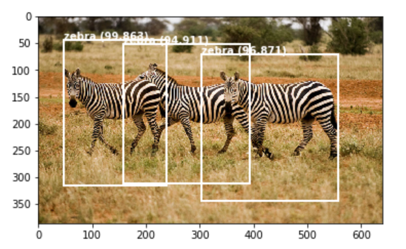
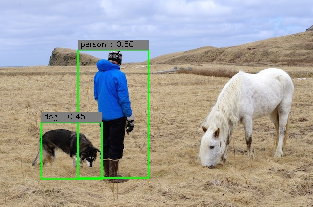
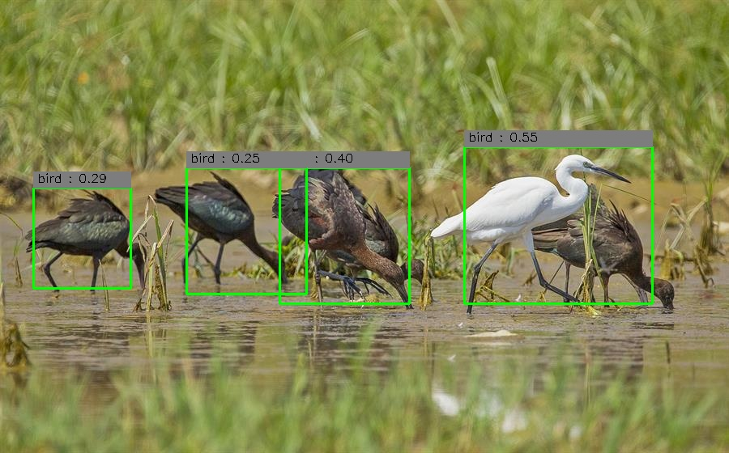

# You Only Look Once: Unified, Real-Time Object Detection [2016]
论文[链接](../papers/yolo.pdf)

## 论文内容

### YOLO介绍
* 将物体检测简化为一个回归问题，从空间上划分边界框，及找到对应的分类概率；
* 只需要一个神经网络，就能完成边框和对应分类概率的预测，方便进行端到端优化；
* 实时识别，可达到45帧/秒；Fast-YOLO，网络规模更小，可以达到155帧/秒；
* 不同于滑动窗口和 R-CNN，YOLO 在训练和测试的时候，看到的都是整个图像，隐式地包含了分类以及类别外形相关的信息，所以产生将背景斑点误判为物体的假阳性错误更少；
* YOLO 检测物体的泛化能力很好，通用性高；
* 但是 YOLO 在定位的准确率方面，尤其是定位一些小物体上，表现略差一些。

### 算法简述
1. 图像划分
* 将一张图像，划分为 S*S 个格子；
* 每个格子需要预测的内容有：
    * B 个边框，一个边框包括以下5个参数：
        * x, y，表示边框中心点相对于格子的位置，所以取值在0到1之间；
        * w, h，表示边框的宽、高，相对于图像的大小，所以取值也在0到1之间；
        * confidence = Pr(Object) * IOU(truth, pred)，这个置信综合考虑了格子内是否存在物体，以及预测的物体边框和真实的物体边框交并比。
            * Pr(Object) = {0, 1}，物体中心如果落在一个格子内，那么这个物体属于这个格子；
            * IoU = (true_box ∩ pred_box) / (true_box ∪ pred_box)
    * C 个分类概率：
        * C是需要识别的物体种类，这里在预测有物体的前提下，预测物体属于每个类别的概率值。
* 所以一张图片的预测维度是，S\*S\*(B\*5+C)
* 选取 PASCAL VOC 数据集，取S=7, B=2, C=20
2. 网络结构

* 网络结构如上图所示，YOLO 共有24层CONV + 2层FC
* 输入图像为 (448, 448, 3)
* 最终输出的预测张量为 7 \* 7 \* 30
3. 模型训练
* 预训练：取模型的前20层CONV + AVG_POOLING + FC，在ImageNet上进行训练；
* 然后添加4层CONV，接上2层FC，随机初始化其参数；
* 最后一层采取线性激活函数，其余层都采取 leaky ReLU 作为激活函数；
* 模型优化目标，如果是最小化误差平方和，那么确实容易计算，但是将定位错误和分类错误混为一谈，平等处理，这样的做法不利于实现平均精度的最大化；而且注意到相同的误差，大边框其实相对小边框更容易接受。所以要对误差平方和进行一些改进：
    * 对边框定位参数，x, y, w, h，平方和前加上一个放大参数 λ_coord，这里取的是5
    * 对没有检测到物体情况下的置信 confidence，平方和前加上一个削弱参数 λ_noobj，这里取的是0.5
    * 对于宽和高，为了增强边框大小对误差的影响，取平方根的差，作为误差。
* 注意到，只有在格子里面有物体的时候，分类误差才会计入损失函数；也只有在格子负责当前物体，也就是格子预测的边框和物体真实边框交并比最高的时候，边框位置误差才会计入损失函数。
* 训练参数：
    * epochs=135, batch_size=64, β=0.9, β_decay_rate=0.0005
    * learning rate α: 1e-2 for 75 epochs, 1e-3 for 30 epochs, 1e-4 for 30 epochs
* Dropout + 数据增强，防止过拟合：
    * 第一个FC后面，加上一层 Dropout(0.5)
    * 对于数据增强，引入随机缩放，和图像的曝光、饱和度随机调整。
4. 模型局限
* 对于一些大的物体，或者中心落在划分格子边界上的物体，YOLO 需要用非最大值抑制来解决多个格子都预测到同一个物体的问题；
* YOLO 对于密集型物体的检测存在限制，比如一群鸟这种，多个物体可能互相重叠，落在一个格子上；
* YOLO 对于预测物体比例没有在训练数据中出现过，或者比例比较不同寻常的边框，泛化能力较差；
* 最后，损失函数中，计算边框误差时，对于边框本身大小的考虑还不够。

### 算法评估
* 主要评估标准：
    * mAP，mean Average Precision，均值平均精度
        * precision = TP/(TP + FP)
        * recall = TP/(TP + FN)
        * 首先计算AP：将样本按 confidence 从高到低排序，然后计算精度和召回率，以召回率为横轴，精度为纵轴，画出 precision-recall 曲线；再对曲线进行一定的平滑，从折线转换为Z字形下降，计算曲线下方的面积就是AP
        * mAP，是计算每个类别的AP，然后取均值
    * FPS, frames per second，一秒识别的帧数
* 基于 PASCAL VOC 2007 数据集
    * YOLO mAP 达到了 63.4%，识别帧数为 45 fps
    * FAST YOLO mAP 达到了 52.7%，识别帧数为 155 fps
    * 平均精度远高于其他实时识别系统，虽然低于 R-CNN 的几个改进版本，但是 R-CNN 的fps最好的版本也不到20
* 重点比较 YOLO 和 Fast R-CNN
    * YOLO 类别识别正确且交并比大于0.5的正确比例更低，主要是因为 YOLO 在物体定位上误差更大，即类别正确但是交并比在0.1到0.5之间的，属于定位误差，所占的比例更高；
    * 但是相比 Fast R-CNN，YOLO 误将背景（不包含任何物体）识别为物体的概率更低，FP的错误更少。
* YOLO 的泛化能力更好，相比其他物体检测算法，YOLO 识别艺术品中物体（比如识别画作中的人）的精度更高；
* 如果连接一个网络摄像头 webcam，使用 YOLO 基本上可以实现实时追踪的效果，即使物体在移动或是改变了形状，也能检测得到。

# 优化版本
## YOLO9000: Better, Faster, Stronger [v2-2017]
* 主要目的：解决 YOLOv1 相比 R-CNN，定位的误差大，召回率也相对低的问题。YOLOv2 在尽量保持检测速度同时，提升定位准确率和召回率，mAP也会得到显著提升。
### 优化
1. 去除 dropout 层，为卷积层加上批归一化 batch normalization 处理；
2. 高分辨率分类器
    * YOLO中，在ImageNet进行预训练的时候，输入图片分辨率为 224\*224，在预训练之后的数据集上，为了提高输入图片的分辨率，输入直接改为 448\*448；
    * YOLOv2中，在预训练以后，先继续在 ImageNet 上，用高分辨率 448\*448 训练10轮，让网络适应一下高分辨率的输入，然后再投入后面的数据集进行微调。
3. 去除YOLO的全连接层，加入锚框/先验框 anchor box
    * 最早在 Faster-CNN 中提出，后用于改进多个算法；
    * 对于不同的目标物体，设置不同形状的锚框，解决多个不同形状的物体落在一个格子内的问题；
    * 首先缩小输入图像的尺寸为 416\*416，然后去掉一层池化层，那么原来的448到7\*2，所以现在的416到输出变为13 （保持输出的尺寸为奇数，方便找到图像的中心点）
    * 每个格子，对每个锚框，都预测存在物体的置信、锚框的偏移量，以及分类概率，不再像v1中共用一套分类概率；
    * 使用锚框后，模型的mAP略有下降，但是召回率提升。
4. k-means 聚类，分析训练集的边框，从而选择出锚框。
    * 聚类分析时，用交并比定义新的距离指标；
    * 综合在数据集 COCO 和 VOC 2007 上的表现，选择k=5
5. 为了增加模型稳定性，预测边框 bounding box 的 (tx, ty, tw, th, to)
    * 蓝色边框为预测的边框，虚线边框为格子的一个先验框；
    * 预测边框的中心点，离格子左上角的距离为 (σ(x), σ(y))
    * 格子和图片的左上角顶点，距离为 (cx, cy)
    * 先验框的形状为 (pw, ph)
    > 
        // 最终预测框的参数为
        bx = σ(tx) + cx
        bx = bx / W
        by = σ(ty) + cy
        by = by / H
        bw = pw * exp(tw)
        bw = bw / W
        bh = ph * exp(th)
        bh = bh / H
        σ(to) = Pr(object) * IOU(bounding_box, truth_box)

6. 为小物体检测提供更为精细的特征图：
    * 添加直通层 passthrough layer，连接高分辨率到低分辨率；
    * 将相邻的特征堆到不同通道里，扩大通道数，从而达到降低图像维度的目的；
    * 有利于检测更小的物体，降低检测粒度。
7. 不固定输入图片的尺寸
    * 采用多尺度输入训练策略，以增强模型的鲁棒性，具体来说就是在训练过程中每过10个批，就随机改变一次输入图片大小；
    * 输入图片尺寸范围是，32*[10, 19] -> [320, 608]
    * 适应大小不同的输入图片：图片分辨率较小时，mAP略低，但是速度更快；采用高分辨率输入时，mAP更高，但是速度略有下降。
8. 基于一个新的网络进行特征提取，Darknet-19，有19个卷积层，5个最大池化层。
### 模型训练
- 先在1000个分类的ImageNet上，预训练模型 Darknet-19，此时模型输入为 224x224，共训练160轮，随机梯度下降 SGD，起始学习率0.1，以4的幂次方衰减，动量取0.9
- 做微调，输入改为 448x448，只训练10轮，lr=0.001
- 改变网络结构，去除最后一个卷积层，加上 3x3x1024 的3个卷积层，一个直通层，还有最后一个 1x1 卷积层输出预测结果，#anchors x (5 + #classes)；训练160轮，起始学习率为0.001，动量取0.9

## YOLOv3: An Incremental Improvement [v3-2018]
* 网络规模更大，但是更为准确。
### 优化
1. 依然使用先验框，预测 (tx, ty, tw, th) 和v2相同，此外还会使用逻辑回归，预测一个 objectness score
    * 如果一个边框和物体真实边框的交并比最高，那么该边框的置信分数为1；
    * 如果还有其他边框也达到了超过0.5的交并比，但并不是最高的，直接忽略；（非最大值抑制？）
2. 使用多个独立的二分类逻辑回归分类器，取代 softmax 多分类。
    * 每个分类器都采取二元交叉熵作为损失函数；
    * 有利于实现多标签情况的分类，也就是一个物体可能属于多个类的重叠情况。
3. 多维度预测
    * 有3个维度不同的输出；
    * 每个输出张量格式为，N \* N \* (3-anchor_boxes * (4-offsets + 1-confidence + #classes))
4. 采用一个新的网络进行特征提取
    * 交替叠加 3\*3 和 1\*1 的卷积层，并且添加残差网络中的 short cut
    * Darknet-53（53层卷积层）
### 网络结构
Darknet-53  
  
YOLOv3  

## 实验
1. YOLO官网[链接](https://pjreddie.com/darknet/yolo/)
2. YOLO官方开源代码[链接](https://github.com/pjreddie/darknet.git)
3. 用tf实现YOLOv1[链接](https://github.com/gliese581gg/YOLO_tensorflow.git)
4. 用tf和keras实现YOLOv2[YAD2K](https://github.com/allanzelener/YAD2K.git)
5. pytorch实现YOLOv3[链接](https://github.com/ayooshkathuria/YOLO_v3_tutorial_from_scratch.git)
6. keras实现YOLOv3[链接](https://github.com/experiencor/keras-yolo3.git)

### [6] keras-yolo3
#### yolo3_one_file_to_detect_them_all.py
    文件加载预训练参数，建立 YOLOv3 模型，并用模型进行预测。
1. 加载模型
- 调用 make_yolov3_model() 创建模型
- 传入参数文件，实例化 WeightReader 对象，调用其 load_weights() 方法，加载官网训练好的模型参数。

2. 进行一次预测
- 准备一张测试图像 zebra.jpg (640, 386)
- 处理图像为标准输入 (416, 416)，转换为数组，数据类型为浮点数，除以255，最后扩展一个维度 -> (1, 416, 416, 3)
- predict() 传入图像，获得预测结果

3. 解码预测结果
- 输出是已经编码的候选边框，需要进行解码；
- 调用函数，decode_netout()
    - 该函数将获取每个数组，并对候选边框和类预测进行解码；
    - 所有大概率不包含对象的边框将被忽略，例如：所有类别概率均低于阈值，这里使用0.6作为这个阈值；
    - 函数返回一个 BoundBox 实例列表，这些实例定义了预测边框的四个角。

4. 展现预测结果
- 调用 correct_yolo_boxes()，拉伸边框到原始图像的尺寸
- do_nms() 进行非最大值抑制
- 筛选，只留下分类概率大于阈值（这里是0.6）的边框
- 作图
    - 对于每个边框，获取xmin, xmax, ymin, ymax
    - 绘制长方形 matplotlib.patches.Rectangle((xmin, ymin), width, height, fill=False, color, linewidth)，给出的第一个坐标是长方形左上角顶点坐标（横纵坐标都最小的一点）
    - 加上标签，用 plt.text(x, y, content, color, fontsize)
- 最终测试结果如下

### [3] tf-yolo1
    yolov3 借鉴其他算法进行了更新，综合性更强，因此考虑先看v3的优化涉及到的论文，实践方面还是从v1开始。
#### YOLO_small_tf.py
    创建模型，直接加载YOLO_small的参数，输入图片获得预测结果。
* 创建类 YOLO_TF
* 属性包括
    * 用于预测的输入输出相关：fromfile, fromfolder, tofile_img, tofile_txt, imshow, filewrite_img, file_write_txt, disp_console
    * 为模型加载的参数文件：weights_file
    * 模型超参数：alpha（激活函数leakyrelu的参数）, threshold（分类概率过滤阈值）, iou_threshold, num_class, num_box, grid_size, classes, w_img, h_img
* 类的方法有
    * \_\_init\_\_(self, argvs)
        * argv_parser(self, argvs)
        * build_network(self)
            * conv_layer(self, idx, inputs, filters, size, stride)
            * pooling_layer(self, idx, inputs, size, stride)
            * fc_layer(self, idx, inputs, hiddens, flat, linear)
        * detect_from_file(self, filename)
            * detect_from_cvmat(self, img)
                * interpret_output(self, output)
                * show_results(self, img, results)
1. 模型创建
* 创建卷积层，conv_layer(self, idx, inputs, filters, size, stride)
    * idx是层的序号，从1开始排列创建
    * 以上一层的输出作为inputs，第一层的inputs是用占位符表示的x，代表输入模型的图像，其形状为 (448, 448, 3)
    * filters 是本层过滤器的数量，size 是过滤器的维度，stride 是卷积的步长
    * 创建卷积层：初始化权重和偏差，填充输入维度，调用tf.nn.conv2d创建卷积层，加上偏差，最后应用激活函数输出。
    > 
        // 生成张量，传入参数，形状、均值和标准差
        tf.truncated_normal(shape, mean, stddev)
        // 创建卷积层
        tf.nn.conv2d(input, filters, strides, padding, 
                data_format='NHWC', dilations=None, name=None)
        // 加上偏差
        tf.nn.bias_add(conv_layer, bias)
        // 应用激活函数
        tf.nn.relu(conv_layer)
        /* 
        注意这里 tf 对每一个 input 维度使用一个单独的 stride 参数
            [batch, input_height, input_width, input_channels]
        一般取的是 [1, s, s, 1]
        */
* 创建池化层，pooling_layer(self, idx, inputs, size, stride)
    > 
        tf.nn.max_pool(input, ksize, strides, padding,
                    data_format=None, name=None)
        // ksize是过滤器大小，strides是步长
        // 同上，对应input张量的四个维度，一般第一个和第四个都取1
* 创建全连接层，fc_layer(self, idx, inputs, hiddens, flat=False, linear=False)
    * 全连接层通过 tf.add, tf.matmul 操作计算得出。
* 读取下载完的参数，tf.train.Saver().restore()

2. 图片读取
* cv2.imread(path, flags)，path 指定路径，flags 指定加载方式
* cv2.resize(src, dsize[])，改变图像尺寸，这里调整为YOLO的输入格式，也就是 448 x 448
* cv2.cvtColor(src, cv2.COLOR_BGR2RGB)，转换色彩空间为RGB
* np.asarray()，转换为 ndarray 的形式

3. 进行预测
* 传入处理完的图片，运行 self.fc_32
* interpret_output(self, output)
    * 拆分 output，读取信息；
    * 重新计算边框的坐标；
    * 过滤掉置信低于 threshold 的边框；
    * 剩下的按照置信从高到低排列，过滤掉和已有边框交并比高于 iou_threshold 的边框；
    * 最后输出结果 result (class_probs, x, y, w, h, confidence)
* show_results(self, img, results)
    * 提取结果中的信息；
    > 
        // 作图：通过致命对角线的顶点画长方形
        cv2.rectangle(image, point1, point2, color, thickness, lineType, shift)
        // 填写标签
        cv2.putText(照片, 添加的文字, 左上角坐标, 字体, 字体大小, 颜色, 字体粗细)
* 如果需要保存预测图片（filewrite_img=True），调用 cv2.imwrite() 保存到指定位置。

4. 预测结果  

* 预测结果类别比较准确，边框的定位误差稍大一些；
* 图2中多个物体重叠在一个格子内，不能检测出多个。